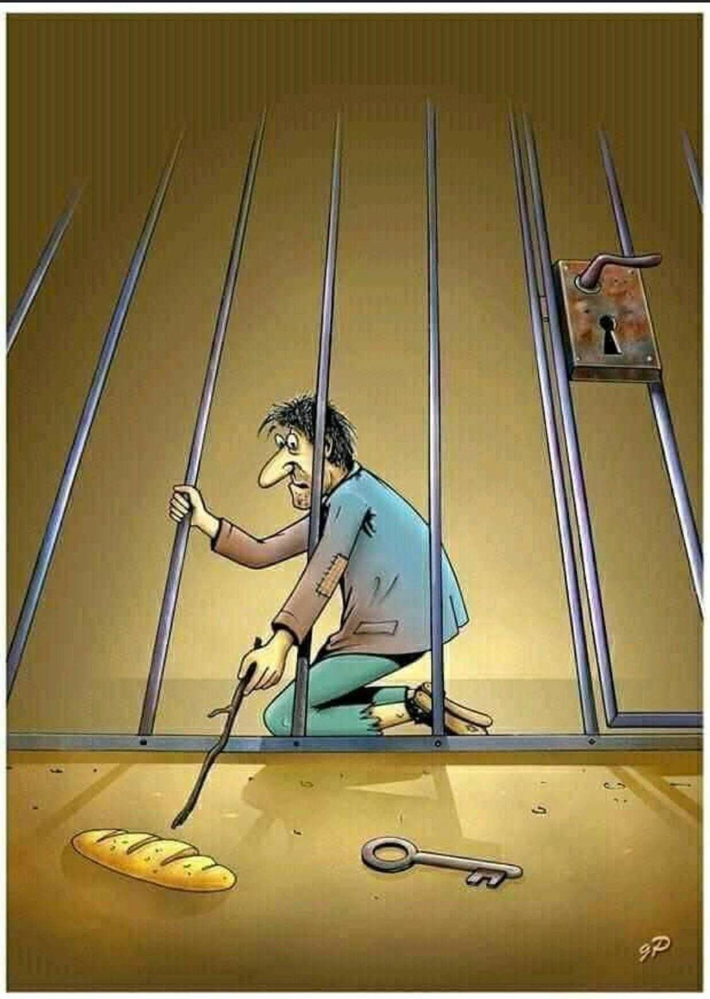

> 

### 아무도 말해주지 않는 데이 트레이더에 대한 5가지 진실 (5 Coisas sobre Day trader que ninguém vai te contar)
<!--
내가 '포렉스(Forex, 외환)' 데이 트레이더를 접한 지 거의 2년이 되었는데, 만약 본인이 아래의 내용들에 공감하거나 받아들이지 못한다면 안타깝게도 이 시장은 당신을 위한 곳이 아니라는 5가지 항목을 정리해 보았다!
-->
1 - 트레이딩은 시작하고 **처음 몇 년 만에 당신을 부자로 만들어주는 수단이 아니다.**

2 - 트레이딩은 (당장의 생활비를 버는) **소득원이 아니다.** 당신은 반드시 재정적으로 안정된 상태에서 매매를 시작해야 한다. 소액의 쌈짓돈이나 당신이 가진 전 재산으로 매매를 하면 멘탈을 뒤흔드는 수많은 트레이딩 트라우마(심리적 가트)가 활성화되어 결국 당신을 파산하게 만들 것이다.

3 - 트레이딩은 당신을 **가장 거대한 내면의 악마들과 정면으로 마주하게 만들 것이다.** "공포, 불안, 우울, 자신감 결여, 결핍의 함정" 등 트레이딩은 당신의 눈앞에 거울을 들이밀고 당신이 진짜 어떤 인간인지를 적나라하게 보여줄 것이다.

4 - 당신은 **손실을 온전히 인정하고, 마이너스 중인 포지션을 과감히 정리할 줄 알아야 한다.** 매일이 좋은 날일 수는 없으며, 당신은 이를 인지하고 그저 아무것도 하지 않고 가만히 있을 줄 알아야 한다. "매매를 하지 않는 것 역시 매매다."

5 - 트레이더가 되는 것은 **매우 느리고 고통스러운 과정**이며, 지독한 회복탄력성으로 버텨야 하는 험난한 길이다. 트레이딩은 인터넷에서 보여주는 것처럼 무슨 '게임'을 하듯 신나고 멋진 세계가 결코 아니다.

만약 당신이 이 항목들 중 최소한 3가지 이상에 깊이 공감한다면, 축하한다. 이 시장은 당신이 도전해 볼 만한 곳일지도 모른다.

왜 수많은 사람이 트레이딩에서 실패하는지 이제는 이해가 된다. 이것은 시장의 문제라기보다는 전적으로 **당신 자신에게 달려있는 문제**이기 때문이다. 트레이딩이 당신의 진짜 본모습을 투명하게 비추기 시작하는 이 단계에 도달하면, 수많은 사람이 포기해 버린다. 이 시장에 적응하기 위해 자신의 마인드셋(생각의 틀)을 바꿀 수 없다고 생각하기 때문이다. 결국 그들은 트레이딩을 포기하는 것이 아니라, **자기 자신을 포기하는 것**이다!

[원문: 5 Coisas sobre Day trader que ninguém vai te contar](5-coisas-sobre-day-trader-que-ninguém-vai-te-contar.pt)
