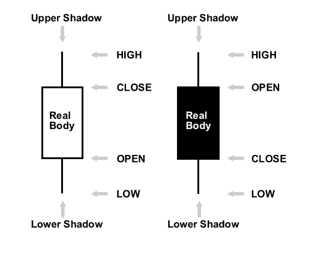
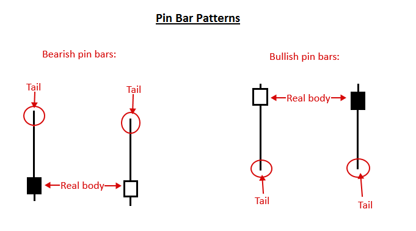
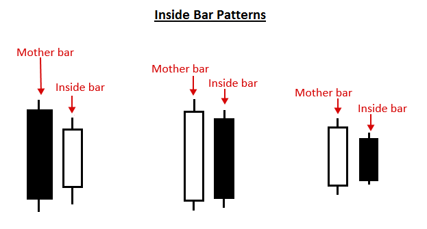
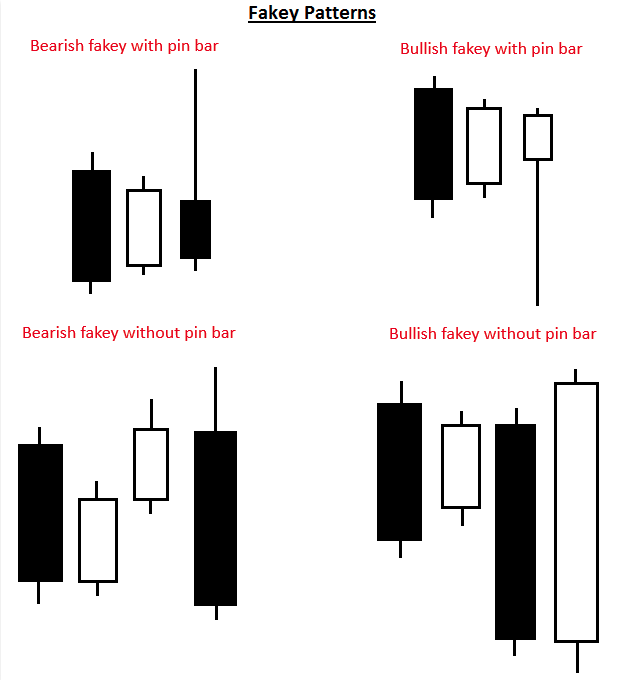
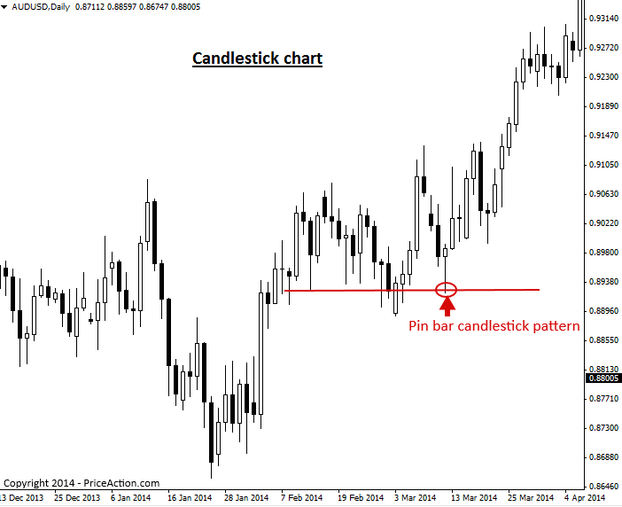

### Introduction to Japanese Candlestick Patterns
(일본식 캔들스틱 패턴 입문)

#### What is a Japanese candlestick pattern?
(일본식 캔들스틱 패턴이란 무엇인가?)

캔들스틱은 특정 기간 동안 시장의 시가, 고가, 저가, 종가를 보여줍니다. 예를 들어 일봉 차트를 보고 있다면, 각 캔들스틱은 해당 날짜 하루 동안 발생한 프라이스 액션의 시가, 고가, 저가, 종가를 반영합니다.

캔들스틱과 표준 가격 바(Price Bar)의 가장 큰 차이점은, 캔들스틱의 경우 시가와 종가 사이의 구간에 색상이 입혀져 있다는 점입니다. 이를 통해 트레이더들은 당일 가격이 상승 마감(우세/상승)했는지 또는 하락 마감(열세/하락)했는지를 빠르게 파본할 수 있으며, 이는 프라이스 액션 트레이더에게 매우 중요한 정보입니다.

더 명확한 이해를 돕기 위해 상승 캔들과 하락 캔들의 그림을 살펴보겠습니다.

참고: 왼쪽 캔들은 종가가 시가보다 높기 때문에 '상승 캔들(양봉)'입니다. 오른쪽 캔들은 종가가 시가보다 낮기 때문에 '하락 캔들(음봉)'입니다.

> 

캔들스틱에서 색상이 채워진 구간을 '몸통(real body)' 또는 바디라고 부릅니다. 참고: 몸통의 색상은 트레이더의 설정이나 개인적 선호도에 따라 다를 수 있습니다. 몸통의 표준 색상 조합은 상승 시 흰색, 하락 시 검은색이며, 저희가 생각하기에 가장 깔끔하고 좋은 옵션입니다.

몸통 위아래로 삐져나온 얇은 선들은 고가와 저가의 범위를 나타내며 '그림자(shadows)', '꼬리(tails)', 또는 '심지(wicks)'라고 부릅니다. 세 가지 명칭 모두 같은 것을 의미합니다. 윗꼬리의 최상단은 '고가(high)'가 되며, 아랫꼬리의 최하단은 '저가(low)'가 됩니다.

#### What is a candlestick pattern?
(캔들스틱 패턴이란 무엇인가?)

캔들스틱 패턴은 프라이스 액션 트레이더들이 시장의 움직임을 예측하기 위해 사용하는 것으로, 캔들스틱 차트상에 시각적으로 표시되는 단일(1개) 또는 다중(여러 개) 캔들의 프라이스 액션 패턴입니다. 패턴을 인지하는 것은 어느 정도 주관적이기 때문에, 캔들스틱 패턴을 식별하고 매매하는 기술을 키우기 위해서는 숙련된 프로 프라이스 액션 트레이더의 교육과 차트 앞을 지킨 시간(Screen Time)을 통한 스스로의 경험이 필요합니다.

수많은 종류의 캔들스틱 패턴이 존재하지만, 상당수는 동일한 기본 원리에서 약간의 변형만 준 것에 불과합니다. 따라서 저희 priceaction.com에서는 본질적으로 동일한 30가지의 다양한 패턴을 억지로 배우려 하기보다, 트레이더가 실전에 바로 활용할 수 있는 견고한 매매 시그널 무기 가방이 되어줄 '수수께끼 같은 몇 가지' 검증된 캔들스틱 패턴에 집중하는 것이 훨씬 현명하다고 생각합니다.

다음은 저희가 가장 선호하는 프라이스 액션 매매 캔들스틱 전략들입니다.

- 핀 바 캔들스틱 패턴 (Pin bar candlestick pattern) – 핀 바 캔들스틱 패턴은 특정 가격 레벨이나 구간에 대한 거부(rejection)를 보여주는 단일 캔들 패턴입니다. 이 패턴은 작은 몸통을 가지고 있으며 한쪽에만 긴 꼬리가 형성되어 있어, 해당 가격대에 대한 거부 의사를 나타냅니다. 핀 바는 추세 내부의 흐름이나 역추세 흐름 모두에서 반전 시그널로 매매할 수 있습니다. 핀 바의 형태는 다음과 같습니다.

> 

- 인사이드 바 캔들스틱 패턴 (Inside bar candlestick pattern) – 인사이드 바 캔들스틱 패턴은 시장의 추세 고민(indecision)이나 일시 정지(stalling)를 나타내는 최소 2개 이상의 캔들 패턴(인사이드 바가 여러 개 연속될 수도 있음)입니다. 인사이드 바 매매 전략은 대개 추세 시장에서 프라이스 액션 돌파 전략으로 가장 잘 작동하지만, 때로는 주요 차트 레벨에서 반전 전략으로 사용되기도 합니다. 인사이드 바의 예시는 다음과 같습니다.

> 

- 페이키 캔들스틱 패턴 (Fakey candlestick pattern) – 페이키 캔들스틱 패턴은 대개 3~4개의 캔들로 구성되며, 인사이드 바 패턴의 허위 돌파(false break)를 보여줍니다. 페이키 패턴은 시장에 '속임수(fake out)'가 발생했음을 나타내며, 이후 가격은 허위 돌파가 일어났던 방향과 반대 방향으로 움직임을 이어갈 가능성이 높습니다. 아래에서 페이키 패턴의 형태를 확인할 수 있습니다.

> 

## What is a candlestick chart?
(캔들스틱 차트란 무엇인가?)

캔들스틱 차트는 일반적인 바 차트의 표준 가격 바나 선 차트의 선 대신, 양초 형태의 '캔들스틱(candlesticks)'들로 채워진 가격 차트를 말합니다.

각 캔들스틱은 해당 캔들이 나타내는 기간 동안의 고가, 저가, 시가, 종가를 보여줍니다. 이는 전통적인 바 차트에 반영된 정보와 동일하지만, 캔들스틱은 이 정보를 훨씬 더 직관적으로 시각화하고 매매에 활용하기 쉽게 만들어줍니다.

다음은 전형적인 캔들스틱 차트의 예시입니다. 이 차트의 지지 레벨(support)에서 형성된 핀 바 캔들스틱 패턴과, 그 직후에 나타난 거대한 상승 움직임에 주목하십시오.

> 

#### Advantage of candlestick charts
(캔들스틱 차트의 장점)

프라이스 액션 분석에서 캔들스틱 차트가 가지는 가장 주요한 장점은 표준 바 차트나 선 차트에서 볼 수 있는 것보다 시간에 따른 가격 움직임을 훨씬 더 강렬하고 직관적으로 시각화하여 보여준다는 점입니다. 종가의 상방(양봉) 또는 하방(음봉) 마감 여부에 따라 각 캔들의 몸통(real body)에 색상이 입혀지기 때문에, 가격 봉들 사이에 나타나는 힘의 역학 관계를 읽기가 훨씬 수월해집니다. 많은 트레이더들은 이 방식이 차트를 보는 '재미'도 더해준다고 말합니다.

결과적으로 트레이더가 표준 바 차트를 쓸지 캔들스틱 차트를 쓸지는 개인의 취향과 판단의 영역입니다. 하지만 저를 포함해 성공한 대부분의 프라이스 액션 트레이더들은 시장 심리(sentiment)를 더 정확하게 파악하고 감각을 유지하기 위해서, 그리고 프라이스 액션 매매 시그널을 더 쉽게 포착하기 위해서 반드시 캔들스틱 차트를 사용해야 한다고 생각합니다.

[원문: Introduction to Japanese Candlestick Patterns](candlesticks.en)
