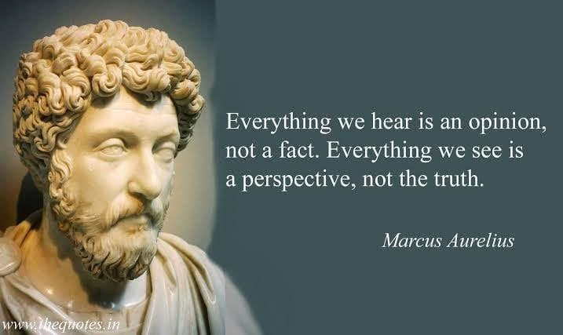

> 

<pre>
<b>유튜브는 알고리즘이 만든 '확증 편향'의 늪</b>

우리가 듣는 모든 것은 의견일 뿐 사실이 아니다.
우리가 보는 모든 것은 관점일 뿐 진실이 아니다.
- 마르쿠스 아우렐리우스 <Marcus Aurelius>

유튜브의 대중화 이후 수많은 트레이더들이 시장에 들어왔지만, 아이러니하게도 실패율이 더 높아진 가장 큰 원인은 '정보의 부족'이 아니라 '마케팅용 공해 정보의 과잉' 때문이다.

<b>1. 알고리즘이 만든 '확증 편향'의 늪</b>

유튜브의 본질은 금융 교육 플랫폼이 아니라 "조회수와 시청 시간을 늘려 광고 수익을 버는 플랫폼"이다.

자극적이고 당장 오늘 밤에 몇백만 원을 벌 수 있을 것 같은 '기법' 영상이 알고리즘의 선택을 받는다.

"지표 발표 때까지 일주일에 3일을 가만히 기다리세요" 같은 정석적인 리스크 관리는 조회수가 안 나오기 때문에 사장된다.

시청자는 자기가 보고 싶은 화려한 단타 영상만 반복해서 보며 "나도 쉽게 벌 수 있다"는 치명적인 확증 편향에 빠진 채 시장에 들어온다.

<b>2. 생산자와 소비자의 '이해관계 불일치'</b>

유튜브 콘텐츠 생산자(유튜버)의 목표와 시청자(트레이더)의 목표는 완전히 반대다.

유튜버의 목표: 매일 새로운 영상을 올려서 조회수를 빼먹거나, 레퍼럴(가입 링크)을 통해 시청자가 자주 샀다 팔았다 하며 수수료를 날리게 만드는 것이다.

트레이더의 성공 조건: 매매 횟수를 극도로 줄이고, 확실한 자리가 아니면 쉬어야 하며, 리스크를 줄이는 것이다.

즉, 유튜브에서 알려주는 "지금 당장 진입할 수 있는 꿀팁"들은 사실 시청자를 수수료 노예로 만들기 위한 설계된 함정인 경우가 대부분이다.

<b>3. '차트짜깁기(Backfitting)'의 사기성</b>

과거 지나간 차트에 줄을 긋고 "여기서 매수했으면 대박 났죠?"라고 말하는 것은 초등학생도 할 수 있다.

'보이지 않는 실전 리스크'는 영상 화면에 담기지 않는다.

개인 투자자들은 그 화려한 결과론적 편집 영상을 '진짜 정보'로 믿고 똑같이 따라 하다가, 실전의 무자비한 현실을 맞닥뜨리고 계좌가 박살 난다.

<b>4. 결론: 진짜 정보는 '지루함' 속에 있다</b>

결국 인터넷과 유튜브에 떠도는 매매 정보의 99%는 컨텐츠를 팔아먹기 위한 '엔터테인먼트 마케팅'에 불과하다.

진짜 시장에서 살아남는 프로들의 정보는 지독할 정도로 재미가 없다. 그들은 차트의 화려한 지표를 보지 않고, 리스크를 피하는 지루한 반복 작업만 할 뿐이다.
</pre>
