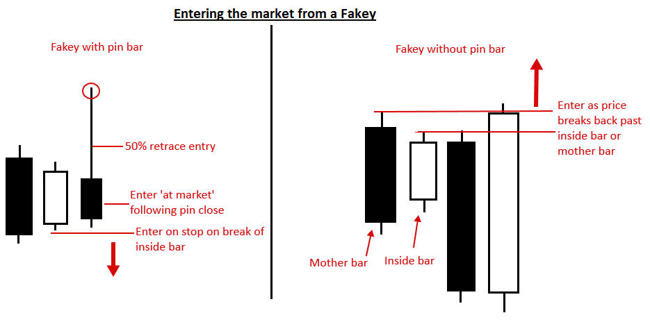
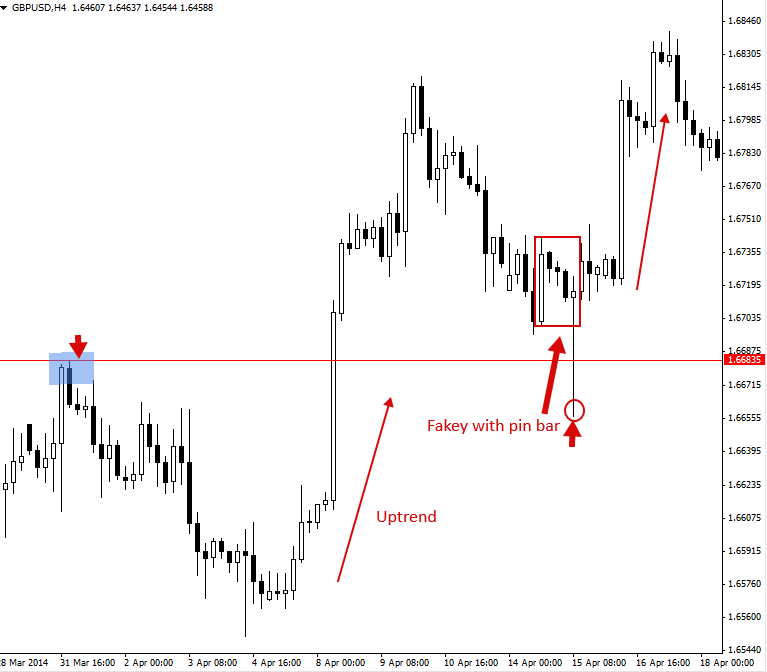
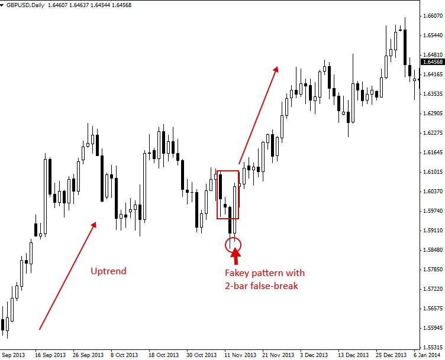
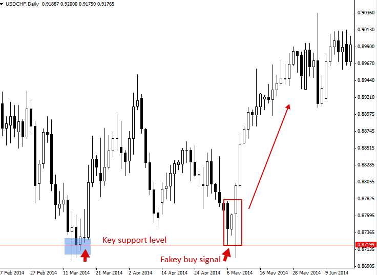
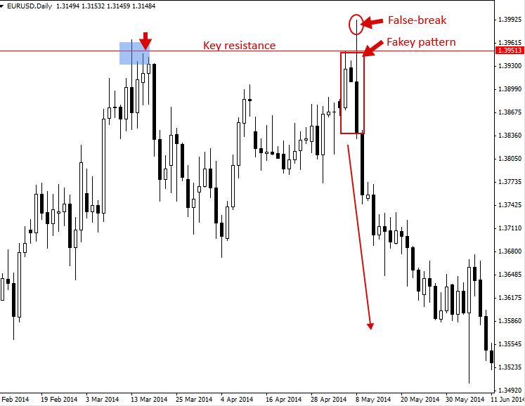

# Fakey Trading Strategy (Inside Bar False Break Out)

## The Fakey Pattern (Inside Bar False Break Out)

Fakey pattern은 “Inside bar pattern으로부터의 False-breakout(속임수 돌파)”으로 가장 잘 설명할 수 있습니다. Fakey pattern은 항상 Inside bar pattern으로부터 시작됩니다. 가격이 처음에는 Inside bar pattern을 깨고 돌파(breakout)하는 듯하다가 이내 빠르게 반전하여 False-break(속임수)를 만들고, Mother bar 또는 Inside bar의 범위 안으로 다시 들어와 마감될 때 Fakey pattern이 성립됩니다.

따라서 이렇게 기억하시면 됩니다: **Inside Bar + False-Breakout = Fakey pattern**.

Fakey pattern은 False-break를 일으키는 bar가 Pin bar의 형태일 수도 있고 아닐 수도 있습니다. 또한 False-break를 일으키는 bar가 두 개의 bar로 구성된 2-bar 패턴일 수도 있습니다. 이 경우 첫 번째 bar는 Inside bar / Mother bar의 범위 밖에서 마감되고, 곧이어 다음 bar가 Mother bar 및 (또는) Inside bar의 범위 안으로 다시 들어와 마감되면서 False-break를 완성하게 됩니다.

Fakey는 매우 중요하고 강력한 Price action trading strategy입니다. 왜냐하면 시장의 ‘거대 세력(big boys)’들이 감행하는 Stop-hunting(손절물량 유도)을 식별하는 데 도움을 주며, 향후 가격이 어떻게 움직일지에 대한 매우 좋은 Clue(단서)를 제공하기 때문입니다. Fakey pattern을 매매하는 방법을 배우는 것은 모든 Price action trader가 진지하게 임해야 할 과제이며, 여러분의 Price action 매매 무기고(arsenal)에 반드시 갖추어야 할 치명적인 무기입니다.

이 Price action strategy의 이해를 돕기 위해 다양한 유형의 Fakey pattern 예시를 살펴보겠습니다.

위 다이어그램에 표시된 서로 다른 Fakey pattern들을 보면, 항상 Inside bar setup이 먼저 발생한 후 Inside bar의 False-breakout이 뒤따른다는 점에 주목하십시오. Fakey는 위 예시들과 미세하게 다를 수 있지만, 위의 네 가지 예시는 여러분이 차트에서 가장 흔하게 접하게 될 대표적인 Fakey trading strategy 유형들입니다.

## How to trade with Fakey Patterns

Fakey pattern은 Trending market, Range-bound(박스권) 시장에서 매매할 수 있으며, 주요 차트 레벨에서 Counter-trend(역추세) 신호로도 활용할 수 있습니다. Forex(외환) 시장에는 수많은 False-breakout이 발생하므로, Fakey pattern 매매법을 익히는 것은 매우 중요합니다. 이를 통해 수많은 Trader들이 피해자가 되는 것과 달리, 여러분은 이러한 속임수 돌파를 역으로 이용해 이득(profit)을 취할 수 있습니다.

Fakey signal의 가장 일반적인 진입(entries) 방식은 다음과 같습니다.

* 최초의 False-break가 발생한 후, 가격이 Inside bar 또는 Mother bar의 고가나 저가를 다시 깨고 복귀할 때 진입합니다. 이는 Stop order(역지정가 주문)나 Market order(시장가 주문)로 진행할 수 있습니다.
* 만약 Fakey pattern에 Pin bar가 포함되어 있다면, Pin bar 진입 방식을 그대로 사용할 수 있습니다.

다양한 시장 조건에서 Fakey signal을 활용해 매매하는 여러 예시를 살펴보겠습니다.

### Trading Fakey’s in a Trending Market

아래 차트는 Trending market에서 False-break bar로 Pin bar가 포함된 훌륭한 Fakey buy signal의 예시를 보여줍니다. 이 signal에서는 Mother bar 구조 내에 실제 세 개의 Inside bar가 존재했다는 점에 주목하십시오. 이는 비교적 흔하게 볼 수 있는 현상이며, 때로는 False-break 또는 ‘Fakey’ bar가 나타나기 전에 Mother bar 내부에 네 개의 Inside bar가 형성되는 것도 볼 수 있습니다.

다음 차트는 Trending market에서 Fakey pattern을 매매하는 또 다른 좋은 예시를 보여줍니다. 이 Fakey pattern이 형성되기 전에 명확한 uptrend(상승 추세)가 유지되고 있었습니다. 특히 이번 Fakey는 2-bar false-break 형태였습니다. 즉, 하나의 bar로 속임수가 끝난 것이 아니라 연속된 두 개의 bar에 걸쳐 False-break가 발생했음을 의미합니다. 이는 시장을 분석하고 매매할 때 주의 깊게 살펴봐야 할 Fakey signal의 또 다른 흔한 형태입니다.

### Trading Fakey’s against the Trend from Key Chart Levels

다음으로 살펴볼 예시는 Counter-trend Fakey입니다. 즉, 최근 또는 단기적인 일봉 차트의 Momentum / Trend와 반대 방향으로 가격이 움직일 수 있음을 암시하는 Fakey입니다. 이 사례는 가격이 하락한 후 주요 Support(지지) 레벨에서 형성된 Bullish fakey buy signal입니다. 이 Fakey signal은 매우 훌륭하고 명확하게(잘 정의되어) 형성되었으며, 하단에 주요 Support 레벨이라는 Confluence(확인 요인)까지 갖추고 있었기 때문에 충분히 진입할 가치가 있는 Counter-trend Fakey였습니다.

Counter-trend Fakey pattern의 또 다른 예시입니다. 이번에는 주요 Resistance(저항) 레벨에서 형성된 Bearish fakey sell signal입니다. 이 Fakey가 형성되기 직전에 시장이 명확하게 상방으로 치닫고 있었음에 주목하십시오. 그 후 Fakey가 형성될 때 시장의 주요 Resistance 레벨 위로 False-break를 일으키며 상방 속임수를 주었고, 이는 하락 변동 가능성에 강력한 ‘무게(weight)’를 더해주었습니다. 이 Bearish fakey 이후 전개된 극적인 투매(sell-off)를 확인할 수 있습니다.

## Tips on Trading the Fakey Pattern:

* 위에 제시된 Fakey 예시들이 여러분이 접하게 될 ‘모든’ 변형 구조를 포함하는 것은 아니며, 단지 가장 흔한 형태 중 일부일 뿐입니다. **Inside bar pattern이 나타난 후, 해당 Inside bar pattern의 False-breakout이 뒤따른다면 높은 확률로 Fakey pattern이 성립된다**는 점만 기억하십시오.
* 앞서 언급한 점이 위에서 다룬 Fakey 조건만 충족하면 ‘모든’ 패턴을 다 매매해야 한다는 의미는 아닙니다. 특정 Fakey로 진입할지 여부는 패턴의 형태뿐만 아니라 **시장의 어느 위치에서 형성되는가**에 따라 달라집니다. 즉, 해당 신호가 Confluence를 가졌는지, 그리고 기저에 깔린 시장 상황 및 역학 관계(dynamics) 속에서 ‘맥락상 타당한지(makes sense)’ 따져보아야 합니다. Price action 매매 교육을 받고 차트를 보는 시간(screen time)과 경험이 쌓이게 되면, 어떤 Fakey(또는 다른 price action 패턴)가 진입할 가치가 있고 어떤 것을 패스해야 하는지 더 잘 이해하게 될 것입니다.
* 초보자 단계에서는 **일봉 차트(daily charts)**의 Fakey signal만 고수하십시오. 일봉 차트 신호는 하위 타임프레임 차트보다 전반적으로 훨씬 높은 정확도와 신뢰도(accuracy / reliability)를 가집니다. 시간이 흘러 경험과 자신감이 쌓이면 그때 4시간봉과 1시간봉 타임프레임의 Fakey를 매매 전략에 편입하셔도 좋습니다.
