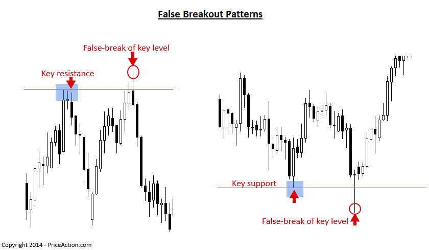
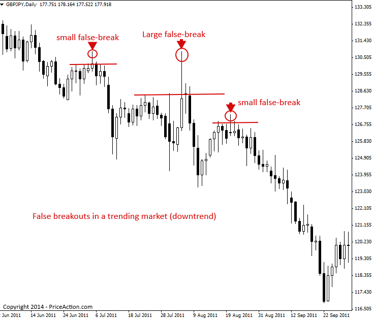
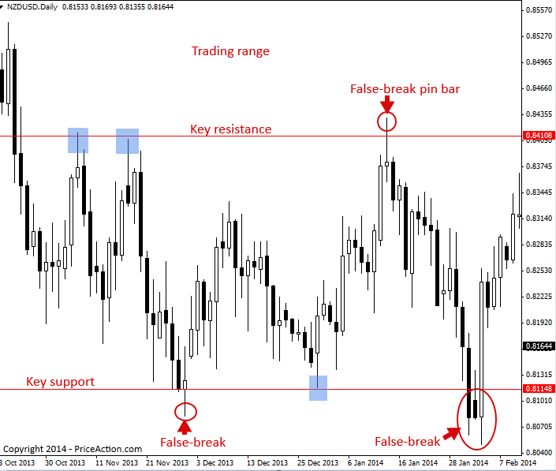
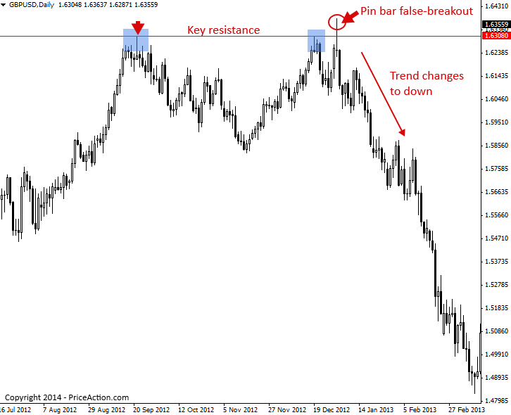

#### 속임수 돌파 매매 전략 (False Breakout Trading Strategy)

#### False Breakout Patterns

False-breakout(속임수 돌파)은 말 그대로 해석하면 됩니다. 특정 레벨을 돌파(breakout)했으나 그 너머로 움직임을 이어가지 못하고 실패하여, 결국 해당 레벨의 '거짓(false)' 돌파로 끝난 것을 의미합니다. False breakout 패턴은 반드시 익혀야 할 가장 중요한 Price action trading 패턴 중 하나입니다. 왜냐하면 False-break는 종종 가격이 방향을 바꾸거나 조만간 추세가 재개될 것임을 알려주는 매우 강력한 Clue(단서)가 되기 때문입니다. 특정 레벨의 False-break는 시장이 감행하는 일종의 ‘기만(deception)’이라고 생각할 수 있습니다. 가격이 그대로 돌파할 것처럼 보여서 돌파라는 '미끼(bait)'를 문 사람들을 순식간에 반전시켜 속여버리기 때문입니다. 주로 아마추어(개인 투자자)들이 '명확해 보이는' 돌파 시점에 진입하면, 프로(기관 등 전문 투자자)들이 시장을 반대 방향으로 밀어붙이는 경우가 많습니다.

Price action trader로서 여러분은 이러한 False breakout의 희생양이 되기보다, 이를 자신에게 유리하게 활용하는 방법을 배워야 합니다.

아래는 주요 레벨의 상방 및 하방에서 발생한 두 가지 명확한 False breakout 예시입니다. False breakout은 다양한 형태로 나타날 수 있음에 주목하십시오. 때로는 Pin bar 패턴이나 Fakey 패턴이 False break를 일으키며 나타나기도 하고, 때로는 그렇지 않기도 합니다.

> 

False breakout은 본질적으로 논리나 앞날을 내다보는 예측이 아닌, 감정에 치우쳐 진입했을지도 모르는 Trader들을 ‘털어내는(flushes out)’ 시장의 ‘역발상적(contrarian)’ 움직임입니다.

일반적으로 False-break가 발생하는 이유는 아마추어 Trader나 시장의 ‘약한 자들(weak hands)’이 대개 매매하기에 ‘안전하다고 느껴질 때’만 시장에 진입하려는 경향이 있기 때문입니다. 즉, 이들은 시장이 이미 한쪽 방향으로 상당히 진행되어(이제 막 Retrace될 준비가 된 시점에) 진입하거나, 주요 Support(지지) 또는 Resistance(저항) 레벨로부터의 돌파를 너무 이른 타이밍에 ‘예측’하고 진입해 버립니다. 프로 Trader들은 아마추어들의 이러한 실책을 예리하게 주시하며, 그 결과로 타이트한 Stop loss(손절매)와 거대한 손익비(risk reward potential)를 확보할 수 있는 매우 훌륭한 진입 기회를 얻게 됩니다.

False-break가 언제 일어날지 알아차리려면 규율과 어느 정도의 ‘촉(gut feel)’이 필요하며, 실제로 패턴이 형성되기 전까지는 결코 ‘확신’할 수 없습니다. 중요한 것은 이들이 어떤 형태로 나타나는지 식별하고 어떻게 매매하는지 파악하는 것이며, 이에 대해 다음에 다루어 보겠습니다.

#### How to trade false breakout patterns

False break는 Trending(추세), Consolidating(수렴), Counter-trend(역추세) 등 모든 시장 조건에서 발생하지만, 이를 매매하는 가장 좋은 방법은 아래 차트에서 보는 것처럼 주도적인 일봉 차트 추세와 일치하는 방향으로 매매하는 것입니다.

아래 차트를 보면 명확한 하락 추세(downtrend)가 진행 중이었으며, 그 추세 내부에서 상방으로의 수많은 False breakout이 발생했음에 주목하십시오. 이처럼 주도적인 추세에 반하는 False breakout을 발견했을 때는, 대개 추세가 다시 재개될 준비가 되었다는 매우 훌륭한 신호가 됩니다. 아마추어 Trader들은 하락 추세의 최저점(bottom)을 잡거나 상승 추세의 최고점(top)을 맞추려는 시도를 매우 좋아하며, 이는 아래에서 보는 것처럼 추세에 반하는 False breakout을 유발하는 원인이 됩니다. 아래 차트의 각 False-break 시점마다 아마추어 Trader들은 하락 추세가 끝났다고 판단하여 매수를 시작했을 가능성이 높습니다. 일단 이러한 매수세가 시작되면 프로들이 다시 개입하여 하락 추세 시장 내의 일시적인 강세를 역으로 이용해 '가치 있는 지점(value)'에서 Short(매도)로 진입합니다. 그 후 하락 추세가 재개되면서 바닥을 잡으려 했던 모든 아마추어 Trader들을 털어내게 됩니다.

아래 차트는 하락 추세 시장 내에서 발생한 False breakout들의 예시를 보여줍니다. 각각의 속임수가 결국 추세의 재개로 이어졌음에 주목하십시오.

> 

False-break는 Trading range(박스권)에서 매우 흔하게 발생합니다. 왜냐하면 Trader들이 박스권 돌파를 선제적으로 맞추려고 자주 시도하지만, 대개 가격은 대부분의 예상보다 더 오랫동안 박스권 내에 머물기 때문입니다. 시장이 Trading range에 갇혀 있을 때 False-break가 다소 빈번하게 일어난다는 점을 인지하는 것은 Price action trader에게 매우 가치 있는 정보입니다.

Range-bound(박스권) 시장을 매매하는 것은 매우 유연하고 수익성이 높을 수 있습니다. 박스권의 Support나 Resistance 경계면에서 Price action 신호가 나타나기를 기다렸다가, 박스권의 반대편을 향해 다시 되돌아가는 흐름을 타면 되기 때문입니다.

Trading range로부터의 False-breakout에 휘말리지 않는 가장 확실한 방법은, 가격이 박스권 외부에서 최소 이틀 이상 종가로 마감(close)할 때까지 단순히 기다리는 것입니다. 만약 이런 현상이 발생한다면 박스권 구간이 끝나고 가격이 다시 추세를 형성하기 시작할 확률이 높습니다.

아래 차트에서 Price action trader가 어떻게 False breakout pin bar 신호를 활용해 Trading range의 False breakout을 매매할 수 있는지 확인할 수 있습니다. Trading range의 주요 Resistance 레벨에서 형성된 False break pin bar에 주목하고, 박스권의 Support 레벨에서 나타난 두 번의 False-break에도 주목하십시오. 경험이 더 많은 Trader들은 Pin bar와 같은 Price action trigger(방정식 신호)를 포함하지 않는 False breakout도 매매할 수 있습니다. 아래 차트에서 Support를 두 번 False-break한 지점들은 둘 다 영리한 Price action trader에게 잠재적인 매수(buy) 신호가 될 수 있었습니다.

> 

False breakout 패턴은 때때로 새로운 추세의 시작과 기존 추세의 종말을 알리는 신호가 되기도 합니다.

아래 차트 예시를 보면 주요 Resistance 레벨이 두 번의 테스트 동안 가격을 막아내다가, 세 번째 테스트에서 가격이 거대한 False-break pin bar strategy를 형성하며 잠재적인 하락 변동이 다가오고 있음을 신호했습니다.

이 차트에서 확인할 수 있듯이, 이 False breakout은 단순히 하락 변동을 암시하는 데 그치지 않고 전체 하락 추세(downtrend)의 서막을 열었습니다.

> 

#### False Breakout Pattern Trading Tips

- False breakout은 Trending market, Range-bound market뿐만 아니라 Counter-trend 상황에서도 발생합니다. 이들은 종종 임박한 시장의 방향성에 대한 강력한 Clue를 제공하므로 모든 시장 조건에서 주의 깊게 관찰하십시오.
- Counter-trend(역추세) 매매는 어렵지만, 추세에 반해서 매매하는 가장 ‘좋은’ 방법 중 하나는 마지막 예시에서 보여드린 것처럼 주요 Support 또는 Resistance 레벨에서 추세에 반하는 명확한 False breakout 신호가 나타나기를 기다리는 것입니다.
- False-breakout은 아마추어와 프로 Trader들 사이에서 벌어지는 ‘전투’를 들여다볼 수 있는 ‘창(window)’을 제공하며, 결과적으로 우리가 프로들과 같은 방향으로 매매할 수 있는 길을 열어줍니다. False breakout 패턴을 식별하고 매매하는 법을 익히면 매매를 바라보는 시야가 완전히 달라질 것입니다.

[원문: False Breakout Trading Strategy](false-break-out.en)
