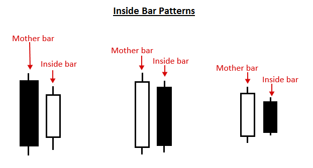
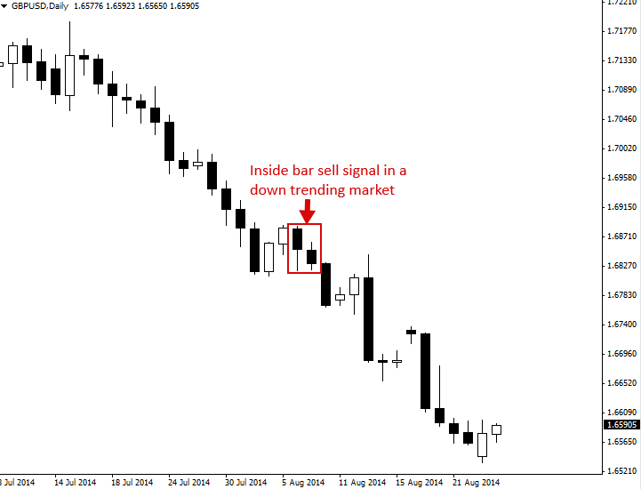
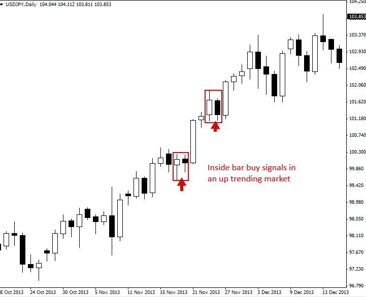
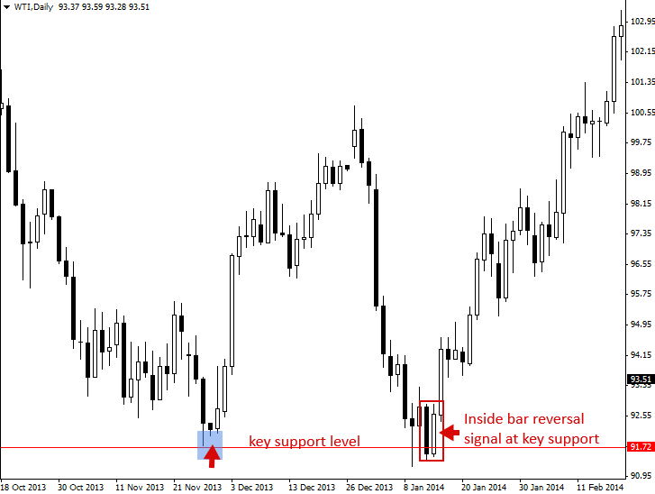
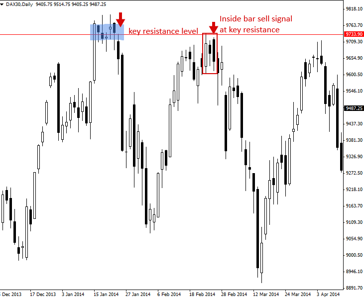

### 인사이드바 매매 전략 (Inside Bar Trading Strategy)

#### The Inside Bar Pattern (Break Out or Reversal Pattern)

“Inside bar” 패턴은 두 개의 bar로 구성된 Price action trading strategy입니다. Inside bar는 이전 bar의 고가와 저가 범위(high to low range)보다 크기가 작고 그 안에 완전히 포함됩니다. 즉, Inside bar의 고가는 이전 bar의 고가보다 낮고, 저가는 이전 bar의 저가보다 높습니다. Inside bar의 상대적인 위치는 이전 bar의 상단, 중앙, 또는 하단 어디든 위치할 수 있습니다.

Inside bar의 직전 bar, 즉 바로 앞의 bar는 흔히 “Mother bar(마더 바)”라고 불립니다. 때로는 Inside bar를 줄여서 “ib”, Mother bar를 “mb”라고 표시하는 것도 볼 수 있습니다.

일부 Trader들은 Inside bar와 Mother bar의 고가가 같거나, 두 bar의 저가가 같은 경우까지 허용하는 다소 완화된 정의를 사용하기도 합니다. 하지만 고가와 저가가 완전히 일치하는 두 개의 bar가 있다면, 대다수의 Trader들은 이를 Inside bar로 간주하지 않는 것이 일반적입니다.

Inside bar는 시장의 일시적인 Consolidation(수렴/횡보) 기간을 보여줍니다. 일봉 차트의 Inside bar는 1시간봉이나 30분봉 차트와 같은 하위 타임프레임에서 보면 ‘삼각형(triangle)’ 수렴 형태로 나타납니다. 이 패턴은 대개 시장이 강력한 움직임을 보인 이후, 다음 움직임을 가져가기 전에 숨을 고르는 ‘정체(pauses)’ 구간에서 자주 형성됩니다. 그러나 시장의 변곡점에서도 형성될 수 있으며, 주요 Support(지지)나 Resistance(저항) 레벨에서 Reversal(반전) 신호로 작용하기도 합니다.

> 

#### How to Trade with Inside Bars

Inside bar는 Trending market(추세 시장)에서 추세와 일치하는 방향으로 매매할 수 있습니다. 이러한 방식으로 매매할 때 이를 대개 ‘Breakout play(돌파 매매)’ 또는 Inside bar price action breakout pattern이라고 부릅니다. 또한 주요 차트 레벨에서 추세와 반대 방향인 Counter-trend(역추세)로도 매매할 수 있으며, 이때는 Inside bar reversal이라고 부릅니다.

Inside bar 신호의 클래식한 진입(entry) 방식은 Mother bar의 고가나 저가에 Buy stop(매수 역지정가) 또는 Sell stop(매도 역지정가) 주문을 배치하는 것입니다. 가격이 Mother bar 위아래로 돌파(breakout)할 때 진입 주문이 체결(filled)되는 구조입니다.

Stop loss(손절매) 위치는 보통 Mother bar의 반대쪽 끝에 설정하지만, Mother bar의 크기가 평균보다 훨씬 큰 경우에는 Mother bar의 중간 지점(50% 레벨) 근처에 배치할 수도 있습니다.

이러한 방식은 Inside bar 셋업의 ‘클래식’ 또는 표준적인 진입 및 손절매 위치일 뿐이며, 숙련된 Trader들은 궁극적으로 상황에 맞춰 자신만의 다른 진입가나 손절매 위치를 결정하기도 합니다.

Inside bar 전략을 활용한 실제 매매 예시들을 살펴보겠습니다.

#### Trading Inside Bars in a Trending Market

아래 예시는 Trending market의 추세 방향과 일치하게 Inside bar 패턴을 매매하는 전형적인 모습을 보여줍니다. 이 사례의 경우 시장이 하락 추세(down-trending)에 있었기 때문에, 이 Inside bar 패턴은 ‘Inside bar sell signal’이라고 불립니다.

> 

Trending market에서 Inside bar를 매매하는 또 다른 예시입니다. 이번에는 시장이 상승 추세에 있었으므로 이 Inside bar들은 ‘Inside bar buy signals’로 지칭됩니다. 아래 예시처럼 강한 추세 속에서는 종종 여러 개의 Inside bar 패턴이 연속해서 형성되는 것을 볼 수 있으며, 이는 추세에 동승할 수 있는 높은 확률(high-probability)의 진입 기회를 반복해서 제공해 줍니다.

> 

#### Trading Inside Bars against the Trend, From Key Chart Levels

아래 예시는 일봉 차트의 주도적인(dominant) 추세에 반해서 Inside bar 패턴을 매매하는 사례입니다. 이 경우 가격이 주요 Support 레벨을 테스트하러 다시 내려와 해당 Support에서 Pin bar reversal을 형성한 뒤, 이어서 Inside bar reversal을 만들었습니다. 이 Inside bar 셋업 이후 전개된 강력한 상승 흐름에 주목하십시오.

> 

최근의 추세 및 Momentum(모멘텀)에 반대되면서 주요 차트 레벨에서 형성된 Inside bar를 매매하는 또 다른 예시입니다. 이 사례에서는 주요 Resistance 레벨에서 형성된 Inside bar reversal 신호를 활용해 매매를 진행했습니다. 또한 아래 예시의 Inside bar sell 신호는 하나의 Mother bar 구조 내에 실제 두 개의 bar가 포함되어 있음에 주목하십시오. 이는 완전히 정상적인 형태이며 차트에서 종종 관찰되는 구조입니다.

주요 Support나 Resistance 레벨에서 Inside bar를 매매하는 것은 매우 유연하고 수익성이 높을 수 있습니다. 아래 차트에서 보는 것처럼, 이러한 신호들은 종종 반대 방향으로의 거대한 움직임을 이끌어내기 때문입니다.

> 

#### Tips on Trading the Inside Bar Pattern

- 초보 Trader 단계에서는 주도적인 일봉 차트 추세와 일치하는 방향으로 Inside bar 매매법을 익히는 것이 가장 쉽습니다. 주요 레벨에서 Reversal play(반전 매매)로 Inside bar를 다루는 것은 다소 까다로우며, 숙련되기까지 더 많은 시간과 경험이 필요합니다.
- Inside bar는 주로 일봉 차트(daily chart) 타임프레임에서 가장 잘 작동합니다. 하위 타임프레임에서는 너무 많은 Inside bar가 무분별하게 발생하며, 그중 상당수는 무의미하고 False break(속임수 돌파)로 이어지기 쉽기 때문입니다.
- 하나의 Mother bar 범위 내에 여러 개의 Inside bar가 포함될 수 있습니다. 때로는 동일한 Mother bar 구조 안에서 2개, 3개, 심지어 4개의 Inside bar가 생기기도 합니다. 이는 완전히 정상적인 현상이며, 단순히 더 오랜 기간 Consolidation(수렴)을 거쳤음을 보여주는 것입니다. 수렴이 길어질수록 대개 더 강력한 Breakout으로 이어집니다. 때때로 ‘Coiling(코일링)’ 형태로 뭉쳐지는 Inside bar를 볼 수 있는데, 이는 하나의 Mother bar 구조 내에 2개 이상의 Inside bar가 있으면서 각 Inside bar가 직전 bar의 고가·저가 범위보다 계속해서 작아지는 형태를 말합니다.
- 실전 매매(live trading)에 적용하기 전에 차트에서 Inside bar를 식별하는 연습을 충분히 하십시오. 여러분의 첫 번째 Inside bar 거래는 반드시 일봉 차트이면서 Trending market인 조건에서 이루어져야 합니다.
- Inside bar는 간혹 Pin bar 패턴이 나타난 직후에 형성되기도 하며, Fakey 패턴(인사이드 바 속임수 돌파 패턴)의 핵심 구성 요소이기도 하므로 반드시 깊이 있게 이해해야 하는 중요한 Price action 패턴입니다.
- Inside bar는 타이트한 Stop loss 배치를 가능하게 하고 패턴 돌파 시 강한 움직임을 동반하는 경우가 많기 때문에, 일반적으로 매우 우수한 손익비(risk reward ratios)를 제공합니다.

[원문: Inside Bar Trading Strategy](inside-bar.en)
