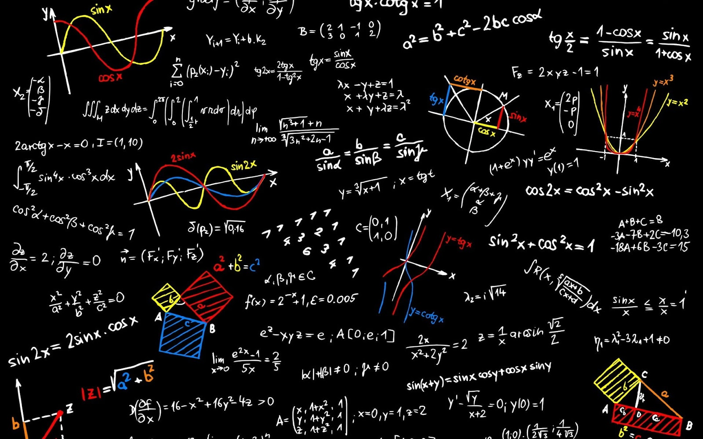

> 

### 시장 분석 프레임워크 구축을 위한 핵심 개념 및 실전 활용 전략

#### 1. 개요 (Executive Summary)
금융 시장에서 단일 지표나 단순한 가격 패턴 분석만으로 지속 가능한 수익을 창출하는 것은 불가능에 가깝다. 성공적인 트레이딩 및 자산 배분 전략을 수립하기 위해서는 시장의 거시적 체질을 정의하고(시장 레짐), 주변 정황을 종합적으로 해석하며(마켓 컨텍스트), 타 자산군과의 동조성을 확인하고(인터마켓 필터), 거래의 집중도를 분석하는(시간 프로파일) 다각적 접근이 필수적이다. 본 보고서는 이러한 핵심 개념들을 체계적으로 정리하고, 월가 대가들의 통찰 및 정량화 통계 모델(마코프 스위칭 모델)과의 연계 방안을 제시한다.

---

#### 2. 월가 대가들의 관점과 프레임워크의 정합성 (Market Legends' Perspectives)
본 프레임워크가 제시하는 시장 분석 기법은 월가를 지배한 전설적인 투자자들의 철학과 완벽히 궤를 같이한다.

* 인터마켓 필터와 폴 튜더 존스 (Paul Tudor Jones)
  * "나는 차트 지표를 보지 않는다. 내가 보는 것은 연준의 정책과 거대 자금의 이정표다."
  * 매크로 자금의 흐름을 추적하는 인터마켓 필터링은 개별 종목의 미시적 움직임보다 연준의 통화 정책과 글로벌 자산 간 역학 관계가 최우선임을 입증한다.
* 시장 레짐과 에드 세이코타 (Ed Seykota)
  * "추세는 차트가 만드는 것이 아니라 인간의 심리와 연준의 유동성이 만든다."
  * 시장 레짐(추세 혹은 횡보)의 전환은 단순한 기술적 과매수/과매도가 아니라, 유동성 환경의 변화와 그에 따른 인간 집단 심리의 변화라는 거시적 원인에서 기인한다.
* 시간 프로파일과 제시 리버모어 (Jesse Livermore)
  * "가격을 움직이는 것은 차트가 아니라 인간의 탐욕과 공포다. 심리가 가장 거칠게 폭발하는 시간(개장 초기)에만 진짜 돈이 움직인다."
  * 하루 중 거래량과 변동성이 가장 집중되는 개장 초기를 정밀하게 분석하는 시간 프로파일링은 시장 참여자들의 가공되지 않은 감정이 가격에 투영되는 핵심 시공간을 포착하는 도구다.

---

#### 3. 시장 분석 프레임워크 가이드 (Core Concepts)

#### 3.1 시장 레짐 (Market Regime)
* 정의: 시장의 행동적 특성이나 통계적 성격(평균, 변동성 등)이 일정 기간 유지되는 본질적인 '체질' 또는 '상태'.
* 주요 유형:
  * 추세 레짐 (Trending): 가격이 한 방향으로 지속해서 움직이는 상태 (상승장 또는 하락장).
  * 평균 회귀 레짐 (Mean-Reverting): 특정 박스권 안에서 가격이 순환하며 평균으로 되돌아오는 상태 (횡보장).
  * 고변동성/저변동성 레짐 (High/Low Volatility): 리스크의 크기와 에너지 축적 상태에 따른 분류.
* 핵심 가치: 현재 레짐을 오판할 경우, 박스권에서 추세 돌파 전략을 쓰거나 추세장에서 역추세 매매를 하여 대규모 손실(Drawdown)을 초래하게 된다. 즉, 전략의 유효성을 결정하는 최상위 필터다.

#### 3.2 마켓 컨텍스트 (Market Context)
* 정의: 현재 시장 레짐이라는 거시적 틀 위에서 벌어지는 주요 지지/저항선, 매물대, 거래량 변화 등 모든 주변 정황을 종합한 '맥락'.
* 레짐과의 관계: 시장 레짐이 '기후'라면 마켓 컨텍스트는 '오늘의 날씨'에 비유할 수 있다. 
* 해석의 차별화: 동일한 기술적 신호(예: 저항선 도달)라도 컨텍스트에 따라 해석이 정반대로 바뀐다.
  * 평균 회귀 레짐 하의 저항선: 강력한 매도(Short) 타점.
  * 강한 추세 레짐 하의 저항선: 돌파 시 추세가 폭발하는 매수(Long) 타점.

#### 3.3 인터마켓 필터 (Intermarket Filter)
* 정의: 주식, 채권, 원자재, 통화(환율) 등 서로 다른 자산군 간의 상관관계 및 자금 이동(Money Flow)을 분석하여 매매 신호의 신뢰도를 높이는 기법.
* 실전 활용:
  * 가짜 신호(False Breakout) 차단: 주식 시장에서 매수 신호가 발생했더라도, 달러 인덱스가 급등하거나 채권 금리가 동반 상승하며 주가에 불리한 환경을 조성한다면 해당 매수 신호를 필터링(보류)한다.
  * 거시적 방향성 힌트: 글로벌 자산 배분 관점에서 위험자산 선호(Risk-On)와 안전자산 선호(Risk-Off)의 전환을 가장 먼저 포착할 수 있다.

#### 3.4 시간 프로파일 (Time Profile)
* 정의: 가격의 움직임에 '시간의 경과'와 '시간대별 거래 집중도'를 결합하여 시장 참여자들의 행태를 분석하는 도구.
* 시간대별 특성: 장 시작 직후(변동성 극대화 및 탐욕과 공포의 충돌), 점심시간(거래량 절벽 및 횡보), 장 마감 전(기관 포지션 청산 및 재구축) 등 시간의 흐름에 따른 정형화된 패턴 활용.

---

#### 4. 정량적 레짐 판별: 마코프 스위칭 모델 (Markov Switching Model)

퀀트 투자에서는 대가들의 주관적인 통찰과 레짐 판단을 정량적 시스템으로 정밀하게 구현하기 위해 제임스 해밀턴(James Hamilton)이 정립한 마코프 스위칭 모델을 도입한다.

#### 4.1 은닉 상태 (Hidden State)의 추정
* 금융 시장의 실제 상태(레짐)는 눈에 보이지 않는 '은닉 상태'이다.
* 모델은 우리가 관측할 수 있는 데이터(일일 수익률, 로그 변동성 등)의 통계적 특성이 갑자기 변하는 시점을 포착하여, 현재 시장이 어떤 레짐에 속해 있을 '확률'을 역으로 계산해 낸다.

#### 4.2 마코프 성질 및 전이 확률 (Transition Probability)
* 마코프 성질: "미래의 상태는 과거의 이력과 무관하게 오직 현재의 상태에 의해서만 결정된다"고 가정한다.
* 전이 확률 Matrix: 상태 i에서 상태 j로 전환될 확률을 추정한다. 금융 시장은 한 번 특정 레짐(예: 저변동성 상승장)에 진입하면 당분간 그 레짐을 유지하려는 관성(지속성)이 매우 강하게 나타난다.

#### 4.3 퀀트 시스템 연계 프로세스 플로우
1. [수익률 데이터 입력]
2. [마코프 스위칭 모델 구동 및 현재 레짐 확률 계산] (인간 심리와 유동성 정체 상태 추정)
3. [인터마켓 필터링] (연준 정책 기조, 채권 금리 및 달러 인덱스 추세 검증을 통한 매크로 필터링)
4. [마켓 컨텍스트 & 시간 프로파일 분석] (개장 초기 심리 폭발 시간대 확인 및 주요 매물대 위치 분석)
5. [최종 포지션 진입 및 리스크 관리 변수 조절]

---

#### 5. 결론 및 제언 (Conclusion)

성공적인 투자 시스템은 고정된 하나의 매매 기법만을 고집하지 않는다. 

1. 마코프 스위칭 모델과 같은 정량적 도구로 최상위 시스템인 시장 레짐을 명확히 정의해야 한다.
2. 정의된 레짐 안에서 인터마켓 필터를 통해 연준의 유동성 방향과 대외적 매크로 리스크를 걸러내야 한다.
3. 최종적으로 마켓 컨텍스트와 시간 프로파일을 결합하여 대가들이 강조한 '진짜 돈이 움직이는 시공간적 타점'을 포착해야 한다.

본 보고서에 정리된 개념들과 월가 대가들의 통찰은 시장의 비선형적 변화 속에서 자산을 안전하게 보호하고 시장 대비 초과 수익(Alpha)을 창출하는 핵심 이정표가 될 것이다.
