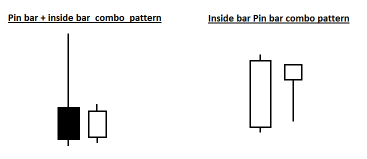
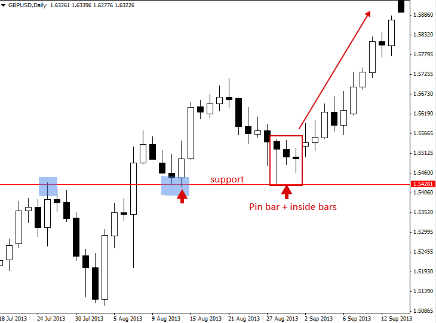
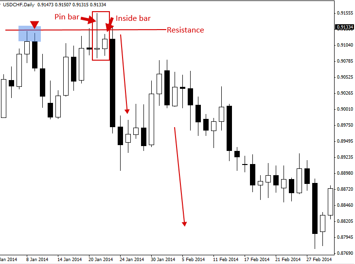
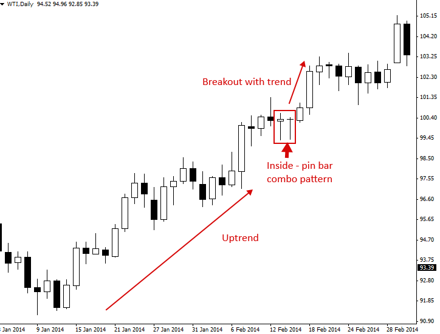
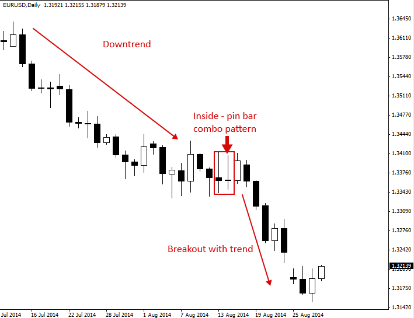

### Pin Bar and Inside Bar Combo Trading Strategy
(핀 바 및 인사이드 바 콤보 매매 전략)

---

#### Pin bar and Inside bar Combo Patterns
(핀 바 및 인사이드 바 콤보 패턴)

핀 바(Pin bar)는 특정 가격대에 대한 거부를 보여주며 조만간 잠재적 반전이 임박했음을 알려주는 프라이스 액션 전략입니다. 인사이드 바(Inside bar)는 수렴 과정을 보여주며 조만간 잠재적 돌파가 임박했음을 알려주는 프라이스 액션 전략입니다. 이 두 가지 시그널이 결합하면 '핀 바 콤보(pin bar combo)' 패턴이나 '인사이드 바 - 핀 바 콤보(inside bar – pin bar combo)' 패턴이 만들어집니다.

핀 바와 인사이드 바의 조합 패턴은 여러분이 시장에서 마주하게 될 가장 강력한 프라이스 액션 시그널 중 하나입니다. 여러분이 집중해서 익혀야 할 주요 '콤보 패턴'은 크게 두 가지가 있습니다.

1) **핀 바 + 인사이드 바 콤보 (The pin bar + inside bar combo)**: 핀 바의 코(Nose) 부근(즉, 핀 바의 몸통 영역)에 작은 인사이드 바를 품고 있는 형태의 패턴입니다.

2) **인사이드 핀 바 콤보 (The inside pin bar combo setup)**: 쉽게 말해 핀 바 자체가 동시에 인사이드 바의 역할을 하는 셋업입니다. 즉, 핀 바의 전체 범위가 직전의 외부 봉 또는 마더 바(Mother bar)의 범위 내에 완전히 갇혀 있는 형태입니다.

> 

---

#### How to Trade the Pin Bar + Inside Bar combo pattern
(핀 바 + 인사이드 바 콤보 패턴 매매법)

핀 바 인사이드 바 콤보 패턴을 찾을 때는 먼저 핀 바 자체를 발견해야 합니다. 만약 핀 바가 출현한 직후, 해당 핀 바의 고가와 저가 범위 내에 완전히 종속된 인사이드 바가 연달아 나타난다면 '핀 바 + 인사이드 바 콤보 패턴'이 성립됩니다. 앞서 언급했듯이, 인사이드 바가 핀 바의 코(몸통) 근처에서 형성되는 것이 가장 이상적입니다.

이번 튜토리얼에서 다루는 두 가지 콤보 패턴 중에서 '핀 바 + 인사이드 바 콤보'가 가장 강력합니다. 이 셋업은 일봉 차트에서 주요 레벨로의 되돌림(눌림목)을 노리거나, 4시간봉 및 일봉 차트의 추세 시장에서 돌파 매매로 활용하기에 아주 이상적입니다.

실제 사례들을 살펴보겠습니다.

아래 차트 예시는 상승 추세 시장에서 지지 레벨(support level)까지 되돌림이 발생한 직후 형성된 멋진 '핀 바 인사이드 바 콤보 패턴'을 보여줍니다. 이러한 유형의 콤보 패턴이 매우 강력한 이유는 핀 바의 중간 지점(50% 레벨) 근처에서 더 유리한 진입 가격을 잡을 기회를 주기 때문입니다. 동시에 손절매(Stop loss) 주문을 인사이드 바의 저가 밑이나 주요 지지 레벨 밑으로 '타이트하게' 설정할 수 있게 해줍니다. 아래 예시처럼 핀 바 다음에 인사이드 바나 여러 개의 인사이드 바가 연달아 붙는 것을 발견했다면, 잠재적인 진입 기회가 온 것이므로 반드시 주목해야 합니다.

> 

핀 바 및 인사이드 바 콤보 패턴의 또 다른 예시입니다. 이번에는 저항 레벨에서 형성되어 해당 저항선에 대한 허위 돌파(false break)를 유발한 뒤 하방으로의 움직임을 촉발했으므로, 추세 반전 패턴에 가깝습니다. 이 콤보 패턴 역시 인사이드 바가 핀 바의 꼬리 쪽으로 되돌림을 줄 때 진입함으로써 '타이트한' 진입가를 확보할 수 있게 해줍니다. 손절매 주문은 저항 레벨 바로 위나 핀 바의 고가 근처에 배치할 수 있었습니다. 가격이 인사이드 바의 저가를 깨고 하방 돌파하는 순간 극적인 폭락(sell-off)이 전개된 것을 확인할 수 있습니다.

> 

---

#### How to Trade the Inside-Pin Bar combo pattern
(인사이드 핀 바 콤보 패턴 매매법)

인사이드 핀 바(Inside pin bar)는 이름 그대로 인사이드 바의 특징을 가진 핀 바를 뜻합니다. 이 셋업은 추세가 확실한 시장과 일봉 차트 타임프레임에서 가장 훌륭하게 작동하는 경향이 있습니다.

아래 예시를 보면, 인사이드 핀 바 콤보 패턴이 형성되기 전에 강한 상승 추세가 이미 자리 잡고 있었습니다. 이후 가격이 마더 바(Mother bar)의 고가를 상방 돌파하는 순간이 바로 추세에 올라타는 진입 시점이 됩니다. 트레이더들은 이와 같은 인사이드 핀 바 콤보 셋업이 나올 때 마더 바의 고가 바로 위에 '바 스톱(Buy on stop, 역지정가 매수)' 주문을 걸어둘 수 있습니다. 그러면 가격이 추세 방향과 일치하게 돌파할 때, 현재 시장의 강한 모멘텀에 자연스럽게 동승하여 거래에 진입하게 됩니다.

> 

아래 차트는 또 다른 좋은 인사이드 핀 바 콤보 패턴의 예시를 보여줍니다. 이번에는 추세가 하락세(bearish)였으며, 가격이 며칠간 수렴하는 과정에서 차트에 표시된 하락 인사이드 핀 바 매도 시그널을 형성했습니다. 인사이드 핀 바 콤보는 추세 시장에서 '지속 패턴(continuation patterns)'으로 매우 유용하게 쓰입니다. 지속 패턴이란 기존 방향으로 추세가 계속 이어질 것임을 암시하는 패턴을 말합니다. 가격이 이 인사이드 핀 바의 마더 바 저가 밑으로 뚫고 내려가는 순간, 공격적인 폭락이 발생한 점에 주목하십시오.

> 

---

#### Pin bar and Inside bar Combo Pattern Trading Tips
(핀 바 및 인사이드 바 콤보 패턴 매매 팁)

- 핀 바 뒤에 인사이드 바가 뒤따라붙는 형태를 항상 예의주시하십시오. 핀 바가 출현한 다음 날 인사이드 바 형태로 하루 동안 잠시 숨 고르기를 하는 현상은, 가격이 핀 바 반전 시그널을 맞고 강력하게 튕겨 나가기 전에 시장에 진입할 수 있는 '마지막 기회'가 되는 경우가 많습니다.
- '핀 바 + 인사이드 바 콤보' 셋업에서는 손절매 주문을 핀 바 전체가 아닌 인사이드 바의 바로 위(또는 아래)에 타이트하게 배치할 수 있는 경우가 많습니다. 이는 포지션 규모(베팅 금액)를 조금 더 크게 가져갈 수 있게 해주며, 해당 거래의 손익비(Risk-Reward) 환경을 극적으로 개선해 줍니다.
- 추세 시장, 특히 눈에 띄게 강한 추세 속에서 인사이드 핀 바 콤보 셋업을 찾아보십시오. 이러한 환경에서 이 패턴들은 돌파 및 추세 지속 플레이로서 매우 높은 신뢰도를 보여줍니다.
- 인사이드 핀 바 셋업은 일봉 차트 타임프레임에서 가장 효과적인 반면, '핀 바 + 인사이드 바' 형태는 일봉과 4시간봉 차트 모두에서 좋은 성능을 발휘합니다.

[원문: Pin Bar and Inside Bar Combo Trading Strategy](pin-bar-inside-bar-combo.en)
