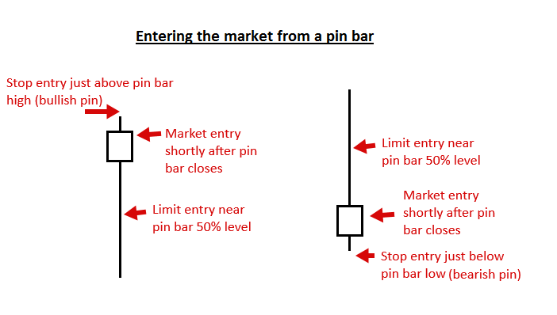
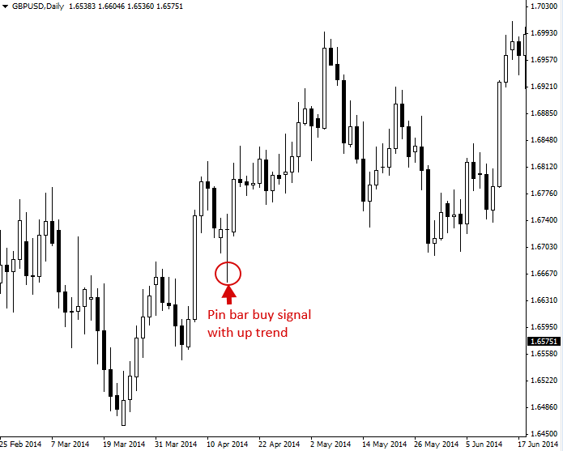
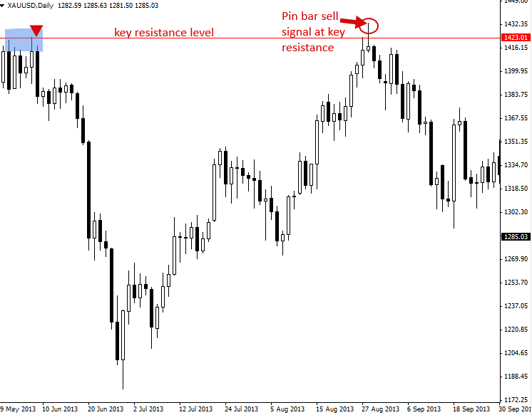
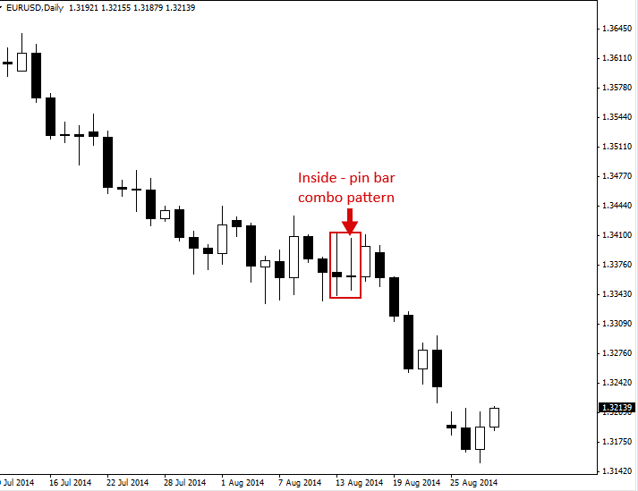
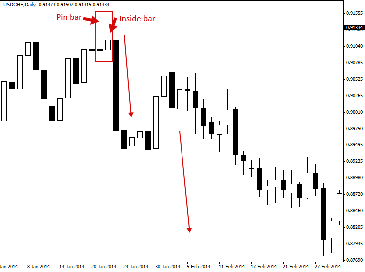
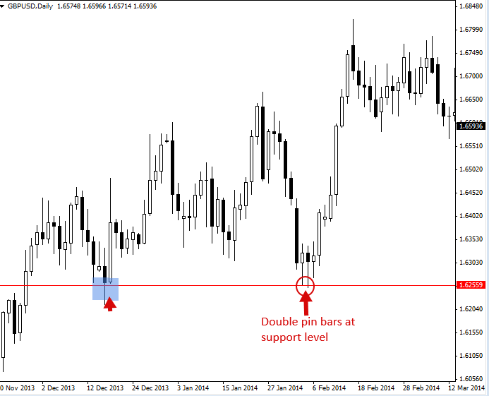

# Pin Bar Trading Strategy

## The Pin Bar Pattern (Reversal or Continuation)

Pin bar(핀바) 패턴은 하나의 Price bar(일반적으로 캔들스틱)로 구성되며, 가격의 급격한 반전과 거부(rejection)를 나타냅니다. 종종 Pin bar reversal(핀바 반전)이라고도 불리는 이 패턴은 긴 꼬리(tail, 혹은 shadow나 wick으로도 표현됨)를 가진 것이 특징입니다. Pin bar의 Open(시가)과 Close(종가) 사이의 영역은 “Real body(몸통)”라고 부르며, Pin bar는 대개 긴 꼬리에 비해 몸통의 크기가 매우 작습니다.

Pin bar의 꼬리는 거부된 가격 영역을 보여주며, 이는 가격이 앞으로 꼬리가 가리키는 방향과 반대로 계속 움직일 것임을 암시합니다. 따라서 Bearish pin bar(하락 핀바) 신호는 긴 윗꼬리를 가진 형태이며, 더 높은 가격에 대한 거부를 보여줌으로써 단기적으로 가격이 하락할 것임을 암시합니다. 반대로 Bullish pin bar(상승 핀바) 신호는 긴 아랫꼬리를 가진 형태이며, 더 낮은 가격에 대한 거부를 보여줌으로써 단기적으로 가격이 상승할 것임을 암시합니다.

## How to Trade with Pin Bars

Pin bar를 매매할 때 Trader가 선택할 수 있는 몇 가지 진입(entry) 옵션이 있습니다. 첫 번째이자 아마도 가장 대중적인 방법은 Pin bar 거래를 “At market(시장가)”으로 진입하는 것입니다. 이는 단순히 현재 시장 가격으로 즉시 거래에 진입하는 것을 의미합니다.

참고: 이를 바탕으로 시장에 진입하기 전에 반드시 해당 Pin bar 패턴이 확정(마감)되어야 합니다. bar가 마감되어 Pin bar 패턴을 완성하기 전까지는 진입 가능한 진짜 Pin bar가 아닙니다.

Pin bar 매매 신호의 또 다른 진입 옵션은 Pin bar의 50% Retrace(되돌림) 시점에 진입하는 것입니다. 다시 말해, 고가에서 저가까지 전체 Pin bar 범위의 약 절반 지점인 “50% 레벨”로 가격이 되돌아오기를 기다리는 방식이며, 해당 지점에 이미 Limit entry order(지정가 진입 주문)를 걸어두고 대기하게 됩니다.

또한 Trader는 Pin bar의 저가 바로 아래나 고가 바로 위에 “On-stop(역지정가 진입)” 주문을 배치하여 Pin bar 신호로 진입할 수도 있습니다.

다음은 다양한 Pin bar 진입 옵션이 차트에서 어떻게 보이는지에 대한 예시입니다.

### Trading Pin Bar Signals in a Trending Market

추세를 따라서 매매(trading with the trend)하는 것은 단연코 모든 시장을 통틀어 매매하는 가장 좋은 방법입니다. Trending market(추세 시장)에서의 Pin bar 진입 신호는 매우 높은 확률의 진입 기회와 훌륭한 손익비(risk to reward) 시나리오를 제공할 수 있습니다.

아래 예시를 보면, 상승 추세(up-trending) 시장 상황 속에서 형성된 Bullish pin bar 신호를 확인할 수 있습니다. 이러한 유형의 Pin bar는 낮은 가격에 대한 거부(긴 아랫꼬리에 주목)를 보여주므로 “Bullish pin bar”라고 불리며, Pin bar에 반영된 거부의 의미는 Bull(매수 세력)이 가격을 더 높이 밀어 올리는 흐름을 재개할 것임을 암시합니다.

### Trading Pin Bars against the Trend, From Key Chart Levels

주도적인(dominant) 추세에 반하여 Counter-trend(역추세)로 Pin bar 매매를 진행할 때, Trader는 반드시 주요 차트 레벨인 Support(지지) 또는 Resistance(저항)에서 진입해야 한다는 것이 정설로 받아들여지고 있습니다. 주요 레벨은 Counter-trend 상황의 Inside bar 패턴에서 그러하듯, Pin bar 패턴에도 강력한 ‘무게감(weight)’을 더해줍니다. 시장에서 가격이 상방이나 하방으로 유의미한 움직임을 시작했던 지점을 발견한다면, 그곳이 바로 Pin bar reversal을 주시해야 할 주요 레벨입니다.

## Pin bar Combo Patterns

Pin bar는 다른 Price action 패턴들과 결합하여 매매할 수도 있습니다. 아래 차트를 보면 Inside pin bar combo 패턴을 확인할 수 있습니다. 이는 Inside bar의 자격도 갖추면서 동시에 Pin bar 패턴의 형태를 띠고 있는 조합입니다. 이러한 Inside pin bar 신호는 아래 차트에서 보는 것처럼 Trending market에서 가장 효과적으로 작동합니다.

아래 차트의 패턴은 Inside-pin bar와 ‘반대’되는 개념으로 간주할 수 있는, Pin bar 신호 내부에 Inside bar가 들어 있는 형태(pin bar + inside bar combo)입니다. Pin bar 패턴의 범위 내에 Inside bar가 형성되는 것은 비교적 흔하게 볼 수 있는 현상입니다. 대개 Pin bar 범위 내부에서 형성된 Inside bar 이후에는 거대한 Breakout(돌파) 움직임이 뒤따르는 경우가 많습니다. 이러한 이유로, 아래 차트에서 볼 수 있듯이 Pin bar + inside bar combo 셋업은 매우 강력한 힘을 발휘하는 Price action trading 패턴입니다.

## Double Pin Bar Patterns

시장의 주요 레벨에서 연속해서 붙어 나오는 “Double pin bar 패턴(더블 핀바)”을 발견하는 것은 그리 드문 일이 아닙니다. 이러한 패턴은 일반적인 Pin bar와 똑같이 매매하면 되지만, 한 레벨에 대해 두 번 연속으로 거부가 일어났음을 반영하므로 Trader에게 조금 더 확실한 ‘Confirmation(확인)’을 제공한다는 차이점이 있습니다.

## Pin Bar Trading Tips

* 초보 Trader 단계에서는 주도적인 일봉 차트 추세와 일치하는 방향으로 Pin bar 매매법을 익히는 것이 가장 쉽습니다. 추세에 반하는 Counter-trend pin bar는 다소 까다로우며, 숙련되기까지 더 많은 시간과 경험이 필요합니다.
* Pin bar는 기본적으로 시장의 Reversal(반전)을 보여주므로, 단기적—때로는 장기적—가격 방향을 예측하기에 매우 훌륭한 도구입니다. 이들은 종종 시장의 주요 고점이나 저점(변곡점)을 표시하곤 합니다.
* 모든 Pin bar가 다 매매할 가치가 있는 것은 아닙니다. 가장 우수한 신호는 강력한 추세 진행 중 추세 내의 Support나 Resistance 레벨로 Retrace된 직후에 발생하거나, 주요 차트 레벨인 Support/Resistance에서 형성될 때 나타납니다.
* 초보자라면 **일봉 차트(daily chart)** 타임프레임의 Pin bar와 **4시간봉 차트(4 hour chart)** 타임프레임의 Pin bar를 최우선으로 주시하십시오. 이 타임프레임들이 가장 정확하고 수익성이 높은 것으로 입증되어 있습니다.
* Pin bar의 꼬리가 길수록 더 유의미한 반전과 가격 거부가 일어났음을 뜻합니다. 따라서 꼬리가 긴 Pin bar는 상대적으로 꼬리가 짧은 Pin bar보다 조금 더 성공 확률이 높은 경향이 있습니다. 또한 꼬리가 긴 Pin bar는 꼬리가 짧은 것보다 가격이 해당 Pin bar의 50% 레벨 근처까지 다시 되돌림(retrace)을 주는 경우가 더 많으므로, 앞서 언급한 50% Retrace 진입 전략을 적용하기에 더 적합한 대상이 됩니다.
* Pin bar는 모든 시장에서 관찰됩니다. 실제 자금으로 매매를 시작하기 전에, 반드시 데모 계좌(demo account)에서 이들을 식별하고 매매하는 연습을 충분히 하십시오. 연습이 완벽을 만듭니다.
