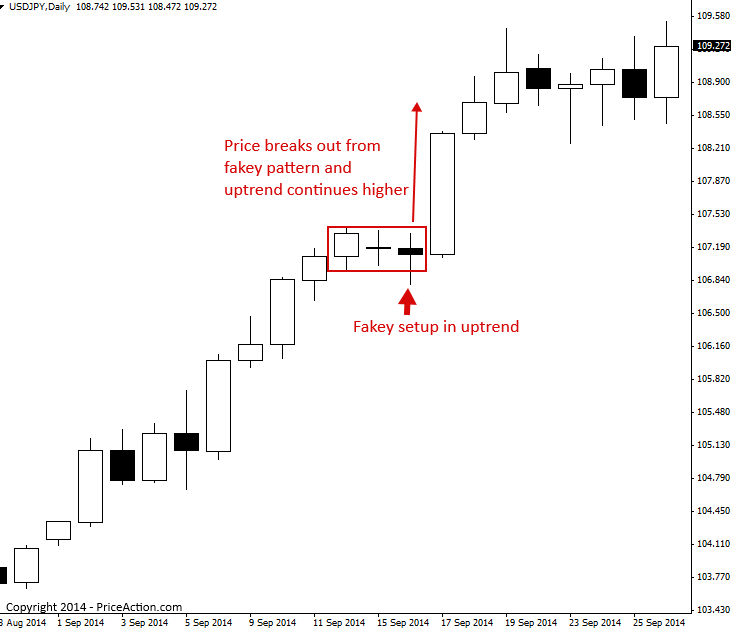
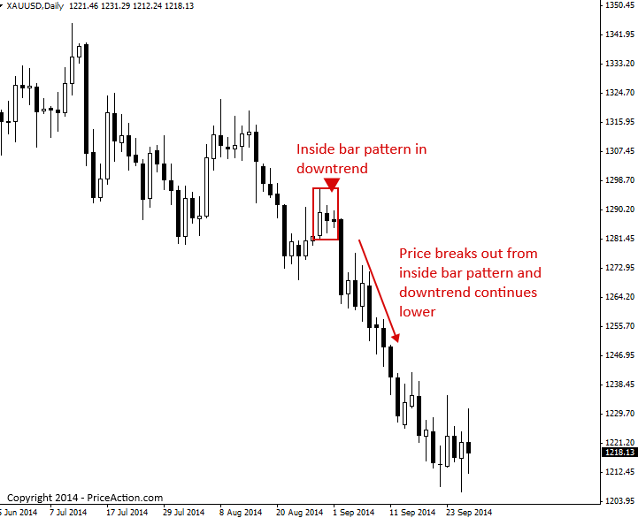
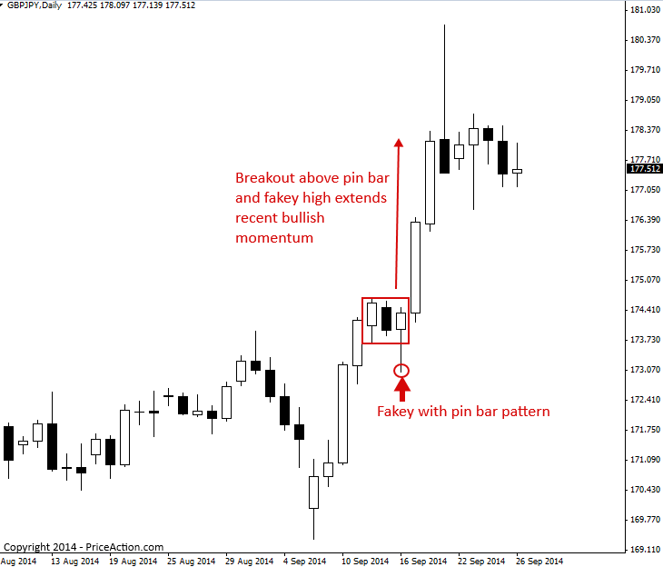
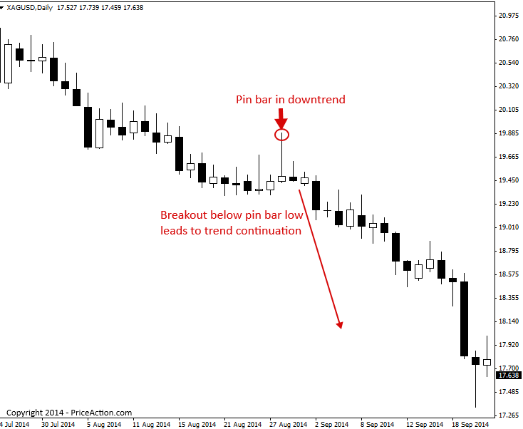
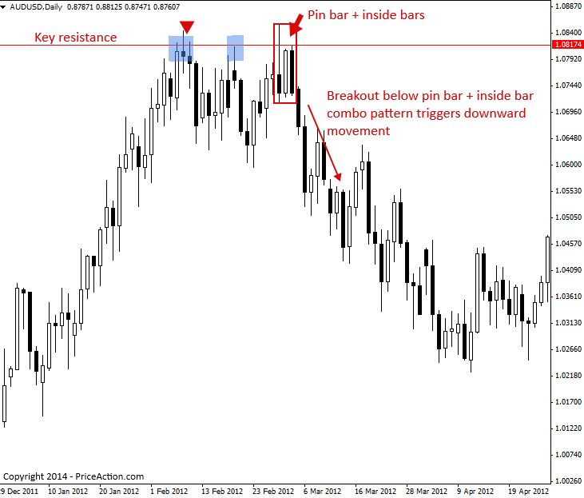
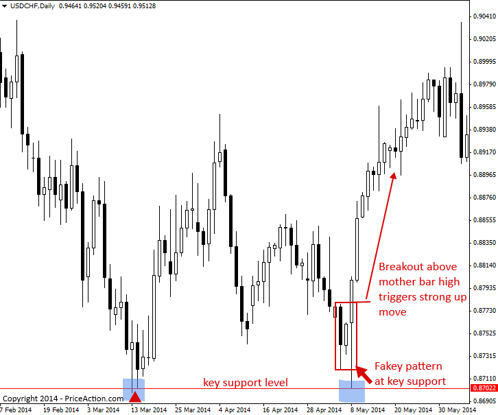

### Price Action Breakout Strategies

프라이스 액션 돌파(Breakout) 전략은 종간에 시장의 강력한 추세적 움직임으로 이어지는 매우 파워풀한 매매 시그널입니다. 돌파 전략은 추세 시장 내에서 형성될 수도 있고 역추세 시그널로 작용할 수도 있습니다. 프라이스 액션 돌파 전략을 정의하는 가장 결정적인 특징은, 돌파가 발생하는 순간 상방이든 하방이든 한쪽 방향으로 강력한 추세성 움직임이 유발된다는 점입니다.

프라이스 액션 돌파 전략의 여러 가지 실제 예시들을 살펴보겠습니다.

#### Trading price action pattern breakouts as continuation plays…
(추세 지속 플레이로서의 프라이스 액션 패턴 돌파 매매)

아래 예시 차트를 보면, 상승 페이키(bullish fakey) 매매 전략 패턴이 형성되기 전에 명확한 상승 추세가 이미 자리 잡고 있었음을 알 수 있습니다. 페이키 패턴의 마더 바(mother bar) 고가를 가격이 돌파하자마자, 상승 추세 내에서 또 한 번의 강력한 상승 파동(leg higher)이 촉발된 것에 주목하십시오. 이것이 바로 추세 시장에서 발생하는 페이키 돌파 전략의 예시이며, 이를 '추세 지속 플레이(trend continuation play)'라고도 부릅니다.

> 

다음 차트는 추세 시장에서 인사이드 바 돌파 전략을 활용한 예시를 보여줍니다. 인사이드 바는 수렴(consolidation) 상태를 거친 뒤 돌파하는 모습을 보여주기 때문에, 어쩌면 프라이스 액션 돌파 전략 중 가장 '클래식'한 패턴이라고 할 수 있습니다. 1시간봉과 같은 하위 타임프레임에서 일봉 차트의 인사이드 바를 들여다보면, 일정한 수렴 구간이나 때로는 삼각형(triangle) 수렴 패턴의 형태를 띠고 있습니다. 따라서 일봉 차트의 인사이드 바를 돌파한다는 것은, 하위 타임프레임에서의 작은 박스권(횡보 구간)을 돌파한다는 의미와도 같습니다.

> 

그 다음 차트 예시는 핀 바가 결합된 페이키 패턴(fakey with pin bar pattern)을 돌파 전략으로 활용하는 방법을 보여줍니다. 이 예시는 강력한 상승 모멘텀의 방향과 일치하게 패턴을 매매하는 모습을 보여주고 있으므로, 이 역시 돌파 및 추세 지속 플레이로 간주됩니다.

페이키 핀 바 패턴이 형성되기 직전에 나타난 강력한 상방 분출에 주목하십시오. 이후 상승 페이키 패턴이 형성되었을 때, 우리는 핀 바와 하방으로의 허위 돌파(false break)를 보고 '추가적인 상승 파동으로 이어질 수 있는 상방 돌파가 다가오고 있구나'라는 것을 직감할 수 있습니다. 실제로 가격이 핀 바의 고가를 넘어선 순간, 상방 돌파가 완벽하게 장악하며 가격이 강하게 치솟은 것을 확인할 수 있습니다.

> 

때때로 상승이나 하락 추세가 매우 강할 때는, 최근 움직임의 최고점(전고점)이나 최저점(전저점) 근처에서 핀 바, 인사이드 바 패턴, 혹은 페이키 패턴이 형성되는 것을 보게 됩니다. 이러한 패턴들은 가격이 이를 돌파할 때 추세 지속으로 이어지기도 합니다. 최근 하락 파동의 최하단이나 상승 파동의 최상단에서 형성된 프라이스 액션 패턴을 매매하는 것은 다소 까다로울 수 있습니다. 보통은 매매 전에 가치 영역(지지나 저항 레벨)으로 먼저 되돌림(rotation)이 나오는 것을 선호하기 때문입니다. 하지만 아래 차트에서 보는 하락 추세처럼 **추세가 매우 강력하다면**, 비록 되돌림이 거의 없었더라도 파동의 끝자락 근처에서 형성된 프라이스 액션 시그널이 추세 방향으로의 지속적인 움직임을 유도할 수 있습니다. 당시에 이 시장의 저점 부근에서 형성되었던 핀 바 매도 시그널(pin bar sell signal)이 바로 그 명확한 예시입니다. 상방 되돌림이 극히 미미했음에도 불구하고, 가격이 핀 바의 저가를 뚫고 하방 돌파하는 순간 또 한 번의 거대한 하락 파동이 촉발된 것을 확인할 수 있습니다.

> 

#### Trading price action pattern breakouts from key chart levels
(주요 차트 레벨에서의 프라이스 액션 패턴 돌파 매매)

'돌파(breakout)'를 어떻게 '반전 플레이(reversal play)'로 매매할 수 있는지 궁금하실 것입니다. 방법은 아주 간단합니다. 프라이스 액션 패턴이 차트의 주요 지지 또는 저항 레벨에서 형성된 뒤, 가격이 해당 패턴을 깨고 돌파하면서 주요 레벨로부터 반대 방향으로 회전할 때, 이를 '돌파-반전 플레이'라고 부릅니다.

아래 차트 예시를 보면, 주요 저항 레벨에서 핀 바 인사이드 바 콤보(pin bar inside bar combo) 패턴이 형성된 것을 확인할 수 있습니다. 가격이 핀 바의 저가(두 개의 인사이드 바를 품고 있는 마더 바의 저가이기도 함) 밑으로 하방 돌파하는 순간, 한 달 이상 지속된 거대한 하락 움직임이 촉발된 것에 주목하십시오.

> 

주요 차트 레벨에서 발생하는 프라이스 액션 패턴 돌파 매매의 또 다른 예시입니다. 이번 사례에서는 시장의 주요 지지 레벨에서 형성된 상승 페이키 매수 시그널(bullish fakey buy signal)을 살펴봅니다. 가격이 인사이드 바의 마더 바 고가를 상방 돌파하자마자(페이키는 인사이드 바의 허위 돌파라는 점을 기억하십시오), 상방으로 강력한 추세성 움직임이 이어진 과정에 주목하십시오. 주요 지지나 저항 레벨에서 이와 같은 페이키 패턴을 발견했다면, 강력한 돌파 움직임이 임박했다는 신호이므로 반드시 주목해야 합니다.

> 

#### Tips on Trading Price Action Breakout Strategies

- 프라이스 액션 돌파 전략은 종종 매우 강력한 움직임을 촉발합니다. 추세 시장에서의 지속 플레이, 주요 차트 레벨에서의 반전 플레이, 혹은 박스권(횡보 구간) 돌파 시점을 노려 이 패턴들을 주시하십시오.
- 돌파 전략은 대개 '스톱 지정가 주문(Stop entry orders, 역지정가 주문)'과 함께 활용됩니다. 즉, 프라이스 액션 돌파 패턴의 고가나 저가 근처에 매수 스톱(Buy Stop) 또는 매도 스톱(Sell Stop) 주문을 미리 배치해 두는 방식입니다. 이후 가격이 실제로 돌파할 때 주문이 체결되면서 시장에 진입하게 됩니다. 강한 모멘텀이 실리는 순간 시장에 동승하게 된다는 점은 매우 긍정적이며, 이는 거래가 최소한 나에게 유리한 방향으로 출발하고 있다는 일종의 추가적인 '중첩(컨플루언스)' 근거가 되어줍니다.

[원문: Price Action Breakout Strategies](price-action-breakout-strategies.en)
