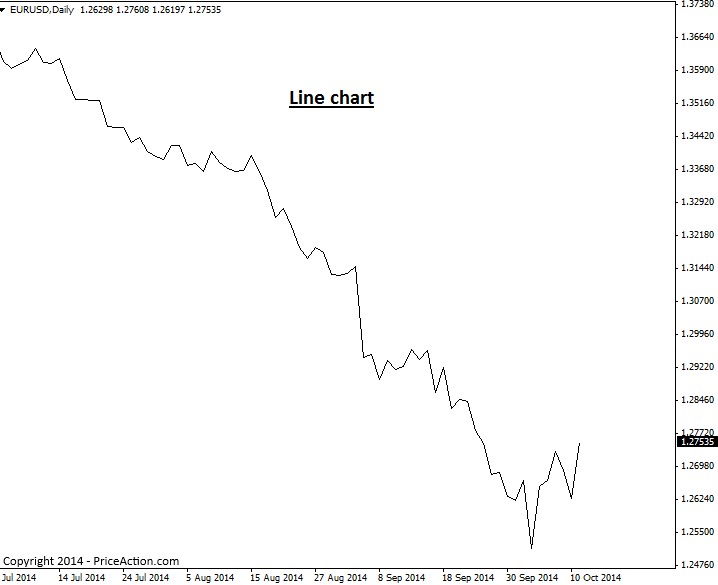
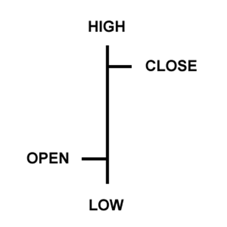
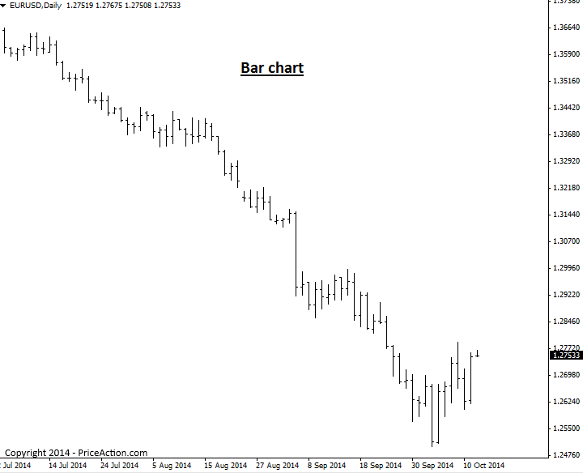
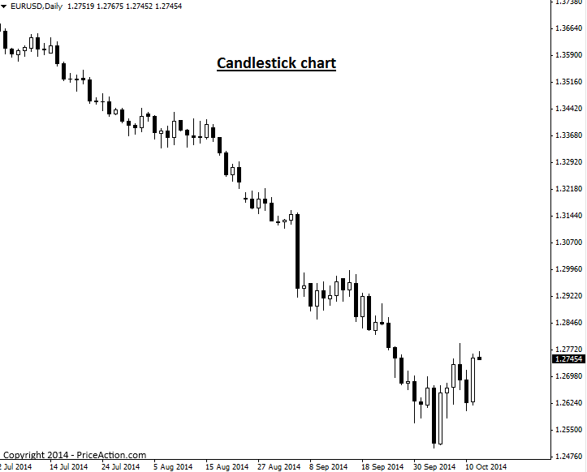

### 가격 차트의 이해 (Introduction to Price Charts)

Price chart(가격 차트)는 일정 기간 동안 특정 시장의 가격을 보여줍니다. 모든 차트 플랫폼에서 다양한 타임프레임(time frames)을 자유롭게 변경할 수 있습니다. 차트 타임프레임은 1분봉 차트부터 월봉, 연봉 차트까지 광범위합니다.

차트의 주된 유형에는 Line chart(선 차트), Bar chart(바 차트), Candlestick chart(캔들스틱 차트) 세 가지가 있습니다. Price action trading에서는 Candlestick chart가 가장 활용하기 '좋은' 유형으로 널리 인정받고 있습니다.

그럼 각 차트 유형에 익숙해질 수 있도록 간략히 개요를 살펴보겠습니다.

#### Line Charts

Line chart는 일반적으로 한 기간의 종가(close)와 다음 기간의 종가를 선으로 연결하여 시장 가격을 표시합니다. 다음은 Line chart의 예시입니다.

> 

Line chart의 가장 큰 장점은 전반적인 시장 Trend와 Support 및 Resistance 레벨을 빠르게 한눈에 파악할 수 있도록 해준다는 것입니다. 다만 각각의 개별 Price bar를 표시하지 않기 때문에, 이를 바탕으로 실제 매매 진입(entry)이나 청산(exit) 의사결정을 내리기에는 실용적이지 않습니다. 하지만 앞서 언급했듯이 시장의 Trend와 주요 레벨을 신속하게 훑어보고 싶을 때는 가끔 유용하게 쓰일 수 있습니다.

#### Bar Charts

Bar price chart는 관찰 중인 타임프레임에 해당하는 ‘표준 Price bar’를 보여줍니다. 만약 1시간봉 차트를 보고 있다면 매 1시간마다 하나의 표준 Price bar가 나타나며, 일봉 Bar chart는 매일 하나의 표준 bar를 보여주는 식입니다.

각각의 개별 Price bar는 매매 결정을 내리는 데 도움이 되는 네 가지 정보, 즉 Open(시가), High(고가), Low(저가), Close(종가)를 제공합니다. 그래서 Bar chart를 종종 OHLC 차트라고 부르기도 합니다. 다음은 하나의 Price bar 예시입니다.

> 

Bar chart는 다음과 같이 각 시간 단위를 표준 OHLC price bar로 표시합니다.

> 

#### Candlestick Charts

Candlestick chart는 위에서 언급한 전통적인 Price bar 대신 Candlestick(캔들스틱)으로 구성된 가격 차트입니다. 각 Candlestick은 해당 기간의 High, Low, Open, Close를 보여줍니다. 이는 전통적인 Price bar가 담고 있는 정보와 동일하지만, Candlestick은 이 정보들을 훨씬 더 직관적으로 시각화하여 활용하기 쉽게 만들어 줍니다.

Candlestick chart는 Bar chart와 마찬가지로 수직선을 통해 해당 기간의 High와 Low를 표시합니다. 상단의 수직선은 Upper shadow(윗꼬리)라고 부르고, 하단의 수직선은 Lower shadow(아랫꼬리)라고 부릅니다. 이 Upper shadow와 Lower shadow는 “wicks” 또는 “tails”라고 표현되기도 합니다. Bar chart와 Candlestick chart의 가장 큰 차이점은 Open 가격과 Close 가격을 표시하는 방식에 있습니다. Candlestick 중앙의 커다란 블록은 Open 가격과 Close 가격 사이의 범위를 나타냅니다. 전통적으로 이 블록을 “Real body(몸통)”라고 부릅니다.

> 

일반적으로 Real body가 채워져 있거나 어두운 색상이면 통화(자산) 가격이 Open 가격보다 낮게 마감(종가 하락)한 것을 의미하며, Real body가 비어 있거나 밝은 색상이면 Open 가격보다 높게 마감(종가 상승)한 것을 의미합니다. 예를 들어 Real body가 흰색이나 다른 밝은 색상인 경우 몸통의 상단이 Close 가격을, 몸통의 하단이 Open 가격을 나타낼 가능성이 높습니다. 반대로 Real body가 검은색이나 다른 어두운 색상이라면 몸통의 상단이 Open 가격을, 하단이 Close 가격을 나타낼 것입니다. (Real body는 사용자가 원하는 대로 색상을 지정할 수 있으므로 여기서는 “가능성이 높다”는 표현을 사용했습니다.)

다음은 앞서 Line chart와 Bar chart 예시에서 사용했던 것과 동일한 차트를 Candlestick chart로 나타낸 모습입니다.

> 

##### Why Candlestick Charts are best for Price Action Trading

다음과 같은 여러 이유로 인해 대부분의 전문 Trader들은 Candlestick chart를 사용합니다.

Candlestick chart는 bar들의 색상화된 Real body를 통해 Trader에게 전반적인 Market sentiment(시장 심리)를 빠르게 보여줍니다. 시장이 매우 강력한 Bullish(상승세)라면 흰색(또는 사용자가 지정한 밝은 색상) Real body가 많이 보일 것이고, 반대로 매우 Bearish(하락세)라면 검은색 Real body가 많이 보일 것입니다. 이것이 Candlestick chart가 가진 큰 장점 중 하나입니다. 한 Candlestick에서 다음 Candlestick으로 이어지는 극적인 시각적 대조 덕분에, Trader는 표준 Bar chart를 사용할 때보다 훨씬 더 쉽고 명확하게 Price action strategy를 포착하고 Price bar 간의 역동적인 움직임 차이를 직관적으로 시각화할 수 있습니다.

또한 모든 플랫폼이 동일하게 생성되는 것은 아니므로, 올바른 Candlestick 차트 플랫폼을 사용하는 것이 매우 중요합니다. Forex(외환) 시장은 매일 뉴욕 거래 시간이 끝나는 뉴욕 동부 표준시 기준 오후 5시에 마감됩니다. 아울러 전 세계 모든 주요 거래소는 주당 5일의 풀 거래일을 가집니다. 따라서 주당 5개의 일봉 bar를 보여주고(일부 플랫폼처럼 6개가 아닌), 매일 뉴욕 시간 오후 5시라는 실제 Forex 시장 마감 시간을 정확히 반영하는 Candlestick 차트를 사용하는 것이 좋습니다.

[원문: Introduction to Price Charts](price-charts.en)
