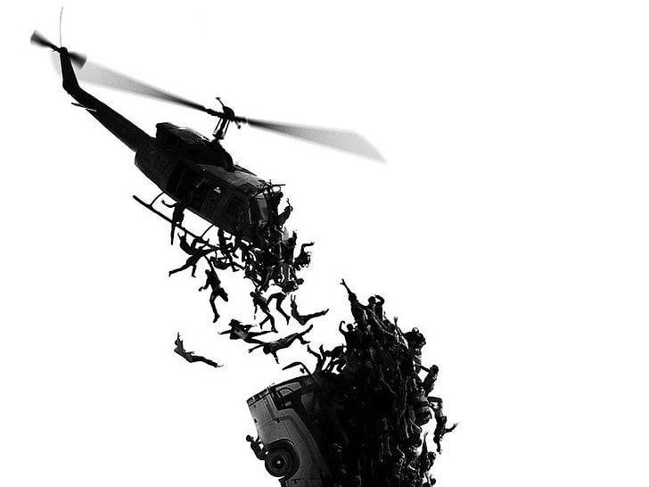

> 

### 인터넷 커뮤니티를 멀리해야 하는 이유

> 개별적으로 보면, 인간은 합리적이고 현명하다.
하지만 군중으로 모이는 순간 멍청이가 된다.
\- 프리드리히 실러

개인은 논리적이고 신중하게 판단하지만, 집단 내에서는 조화에 대한 압박, 의견 동조, 책임감 감소 등으로 인해 비합리적인 판단을 하게 된다.
이는 심리학 및 사회심리학에서 집단 사고, 군중 심리, 집단 극화 등으로 설명할 수 있다.

#### 1. 집단 사고
구성원들이 이견을 제기하지 않고 만장일치에 도달하려는 심리 현상이다.
갈등을 피하고 조화를 유지하려는 욕구가 비판적 사고보다 앞서기 때문에 발생한다.

#### 2. 집단 극화
원래보다 더 극단적인 방향으로 쏠리는 현상이다.
비슷한 생각을 가진 사람들이 모이면 확증 편향이 강화되고, 동조하면서 극단적인 방향으로 향하게 된다.

#### 3. 정보 폭포/동조 현상
자신의 판단이나 정보를 무시하고 먼저 행동한 사람들의 선택을 맹목적으로 따르는 현상이다.
"남들이 다 하니까 맞겠지"라는 생각으로 자신의 논리적 사고를 멈추고 군중의 행동에 편승한다.

#### 4. 책임 분산 및 사회적 태만
집단 속에 있을 때 개인이 책임감을 덜 느끼거나 노력을 줄이는 현상이다.
"내가 안 해도 누군가 하겠지" 또는 "잘못되어도 내 책임만은 아니다"라는 심리가 작용하여 고민을 하지 않게 된다.

#### 5. 군중 속의 익명성
익명성 뒤에 숨어 평소라면 하지 않을 비이성적인 행동이나 결정을 내리는 현상이다.
