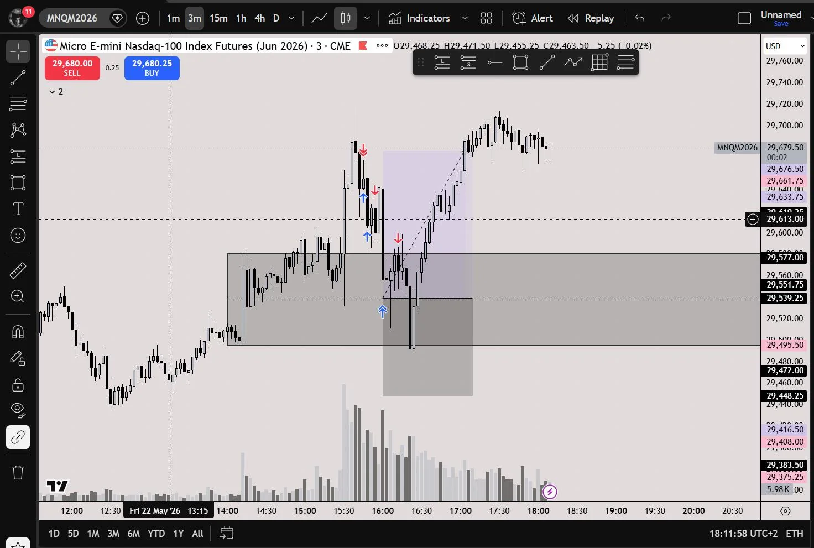

> 

i basically look at what the big players(wall street) are doing. i know that they enter in the first 15 minutes(8 am est), this creates a zone.

i pay attention to whether theyre long or short. i wait til 9:30 open to avoid any losses, then i wait for price to enter that zone again.

i know that if the big players are long they’re going to protect that zone and push price up.

this works for shorts akas well. this is the trade i would have taken if i hadn’t made profit earlier.

last month i took this trade 15 times and it played out 14 times, and ive backtested almost anout 6 months of this lol

저는 기본적으로 월가의 큰손들이 무엇을 하는지 살펴봅니다. 그들이 오전 8시(미국 동부시간)부터 15분 이내에 진입한다는 것을 알고 있죠. 이 시간대가 특정 영역을 형성합니다.

그들이 매수 포지션을 취하고 있는지 매도 포지션을 취하고 있는지 주시합니다. 손실을 방지하기 위해 오전 9시 30분 개장까지 기다렸다가 가격이 다시 그 영역에 진입할 때 진입합니다.

큰손들이 매수 포지션을 취하고 있다면 그 영역을 지키면서 가격을 끌어올릴 것이라는 것을 알고 있습니다.

이 전략은 매도 포지션에도 효과적입니다. 이전에 수익을 내지 못했다면 제가 했을 거래이기도 합니다.

지난달에 이 전략을 15번 시도해서 14번 성공했고, 약 6개월 동안 백테스팅도 해봤습니다.

Thank you so much for sharing this strategy! So if I understand correctly, you draw a zone (similar to a ORB) from 8AM EST to 9:30EST and then enter based on your idea of market direction?

How do you determine if we are long at the open or not?

What is your entry signal? When I look at your today’s chart, it seems that you started by selling despite having a long bias.

What is the line in the middle of your zone?

Thank you so much for sharing!

이 전략을 공유해 주셔서 정말 감사합니다! 제가 제대로 이해한 건가요? 오전 8시부터 9시 30분(미국 동부시간)까지 특정 영역(ORB와 비슷한)을 설정하고 시장 방향에 대한 예측을 바탕으로 진입하는 건가요?

개장 시점에 매수 포지션인지 매도 포지션인지는 어떻게 판단하나요?

진입 신호는 무엇인가요? 오늘 차트를 보니, 매수 포지션을 유지하려 하셨음에도 불구하고 매도로 시작하신 것 같습니다.

중간에 있는 선은 무엇인가요?

공유해 주셔서 감사합니다!