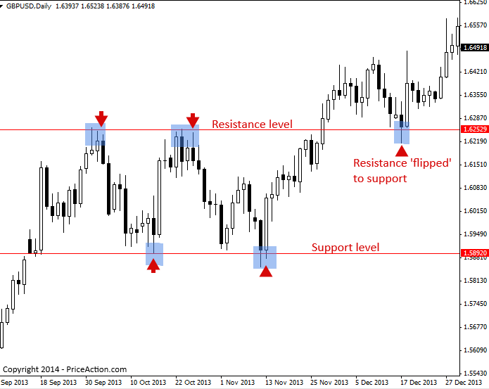
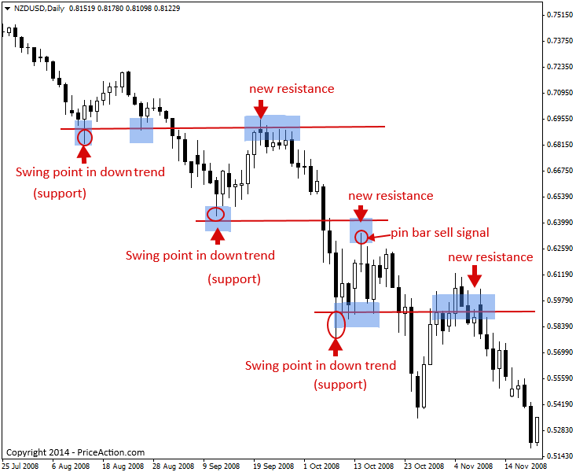
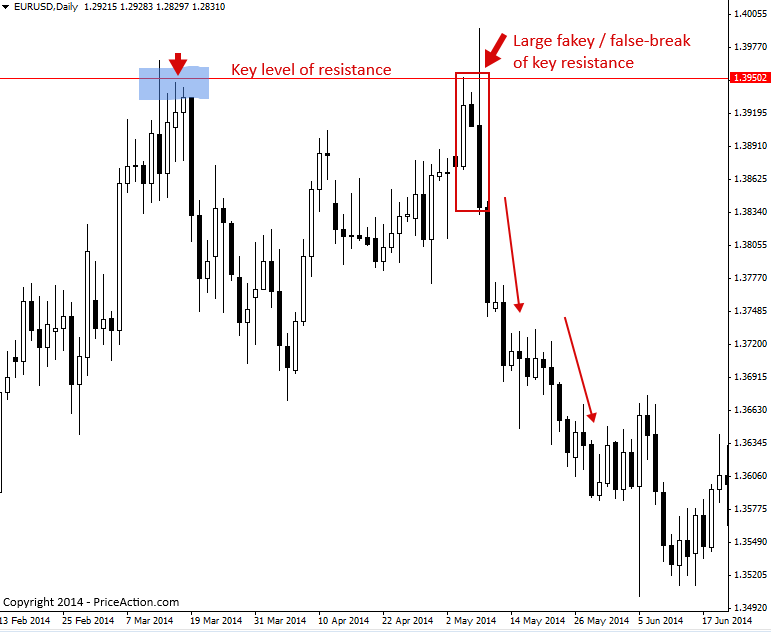
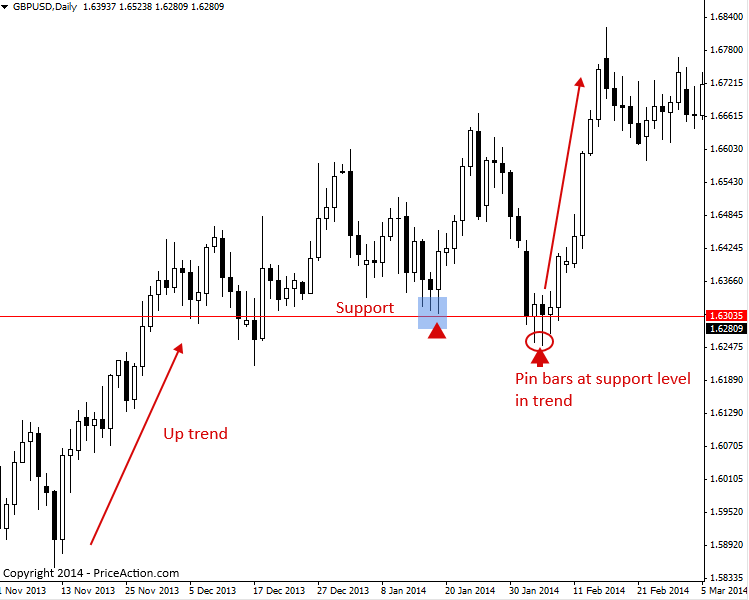
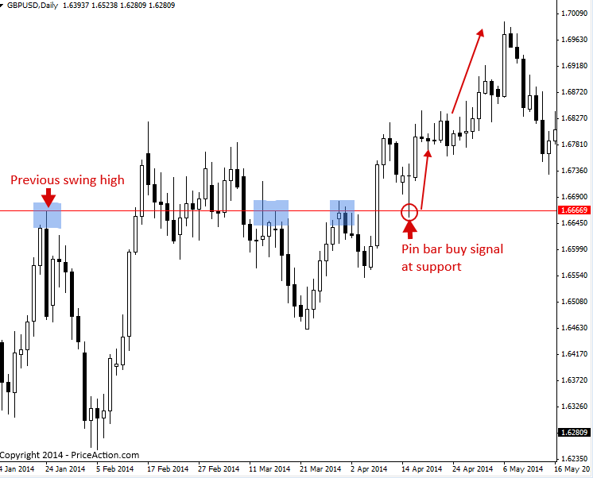
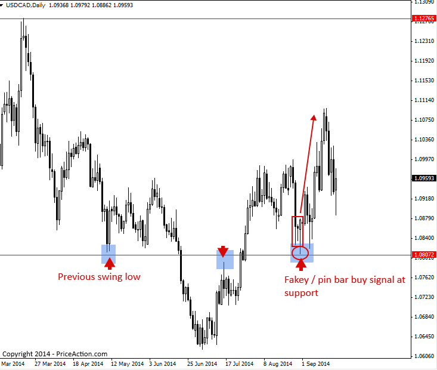

### 지지와 저항 구간 매매 전략 (Support and Resistance Levels Trading Strategy)

#### What is support and resistance?

Support(지지)와 Resistance(저항) 레벨은 일반적으로 Price bar의 고점(high)과 다른 고점을 연결하거나, 저점(low)과 다른 저점을 연결하여 가격 차트 상에 형성되는 수평적인 가격 레벨(horizontal price levels)을 의미합니다.

Support 또는 Resistance 레벨은 시장의 Price action이 반전되어 방향을 바꿀 때 형성되며, 시장에 Peak(정점)나 Trough(골짜기) 같은 Swing point(스윙 포인트)를 남깁니다. Support와 Resistance 레벨은 아래 차트에서 보는 것처럼 Trading range(박스권)를 만들어내기도 하고, 시장이 Retrace(되돌림) 과정을 거치며 Swing point를 남기는 Trending market(추세 시장)에서도 관찰할 수 있습니다.

가격은 종종 이러한 Support와 Resistance 레벨을 존중하는 경향이 있습니다. 다시 말해, 가격이 이 레벨을 깨고 뚫고 나가기(break through) 전까지는 가격의 움직임을 가두어두는 역할을 합니다.

아래 차트는 Support와 Resistance 레벨이 Trading range 안에서 가격 움직임을 가두고 있는 예시를 보여줍니다. Trading range란 아래에서 보는 것처럼 평행한 Support와 Resistance 레벨 사이에 가격이 갇혀 있는 영역을 말합니다 (가격은 Trading range 내에서 Support와 Resistance 레벨 사이를 오르내리며 진동합니다).

아래 차트에서 가격이 결국 상방으로 돌파(break up)하여 Trading range를 벗어나 Resistance 레벨 위로 움직인 점에 주목하십시오. 그 후 가격이 다시 내려와 과거의 Resistance 레벨을 테스트했을 때, 이 레벨은 가격을 지탱해주며 Support 역할을 수행했습니다.

> 

시장에서 Support와 Resistance 레벨이 생성되는 또 다른 주된 방법은 추세 속의 Swing point에서 기인합니다.

시장이 추세를 보일 때, 해당 추세 내에서 Retrace 과정이 발생하며 이 Retrace는 시장에 ‘Swing point’를 남깁니다. 이는 상승 추세(uptrend)에서는 Peak(정점)의 모습으로, 하락 추세(downtrend)에서는 Trough(골짜기)의 모습으로 나타납니다.

상승 추세에서는 가격이 과거의 Peak를 위로 뚫고 올라간 뒤, 다시 아래로 Retrace되어 해당 레벨을 테스트할 때 과거의 Peak가 Support 역할을 하는 경향이 있습니다. 하락 추세에서는 이와 반대로, 가격이 과거의 Trough를 아래로 뚫고 내려간 뒤, 다시 위로 Retrace되어 해당 레벨을 테스트할 때 과거의 Trough가 Resistance 역할을 하는 경향이 있습니다.

다음은 하락 추세에서 시장이 이전의 Swing point(Support)를 테스트하는 예시입니다. 시장이 과거의 Support를 테스트하기 위해 되돌아올 때, 해당 레벨이 '새로운' Resistance로 작용하며 매우 자주 가격을 막아선다는 점에 주목하십시오. 추세가 이처럼 이전의 Swing point를 터치하고 되돌아올 때가 추세에 진입(entry)하기 가장 현명한 타이밍입니다(아래 차트의 Pin bar sell signal 참조). 왜냐하면 이러한 레벨에서 추세가 재개될 가능성이 가장 높아 low-risk / high-reward(낮은 위험 대비 높은 보상) 잠재력이 만들어지기 때문입니다.

> 

#### How to trade price action signals from support and resistance levels

Support와 Resistance 레벨은 Price action trader에게 '가장 좋은 친구'와 같습니다. Price action 진입 signal이 주요 Support나 Resistance 레벨에서 형성될 때, 이는 높은 확률(high-probability)을 가진 진입 시나리오가 될 수 있습니다. 주요 레벨은 여러분의 Stop loss(손절매) 주문을 그 너머에 안전하게 배치할 수 있는 '장벽'을 제공합니다. 또한 이 레벨이 시장의 변곡점이 될 가능성이 크기 때문에, 대개 시장의 주요 Support 및 Resistance 레벨에서는 훌륭한 손익비(risk reward ratio)가 형성됩니다.

Pin bar signal 등과 같은 Price action 진입 신호는 가격이 실제로 주요 Support나 Resistance 레벨로부터 반대 방향으로 움직일 것이라는 일종의 'Confirmation(확인)'을 우리에게 제공합니다.

아래 예시 차트를 보면 주요 Resistance 레벨과 그 지점에서 형성된 Bearish fakey strategy를 확인할 수 있습니다. 이 Fakey가 매우 공격적인 Reversal(반전)과 주요 Resistance 레벨 위의 False-break(속임수 돌파)를 보여주었기 때문에, 해당 signal 이후 가격이 계속해서 하락할 확률이 매우 높았습니다.

> 

다음 예시 차트는 상승 추세의 Support 레벨에서 Price action을 매매하는 방법을 보여줍니다. 명확한 Pin bar buy signal(이 경우에는 실제 두 개의 pin bar 신호)이 나타나자마자, 상승 추세가 재개될 준비를 마치고 주요 Support 레벨로부터 크게 상승한 것을 확인할 수 있습니다.

> 

다음 차트 예시는 Trending market에서 이전의 Swing level이 어떻게 새로운 Support 또는 Resistance 레벨로 작용하는지, 그리고 Price action 진입 신호를 포착하기 위해 우리가 어디에 주의를 집중해야 하는지 좋은 기준을 보여줍니다.

이 사례에서 추세는 상승세였으며, 상승 추세 중 이전의 Swing high(전고점)는 가격이 그 위로 돌파한 이후 결국 Support 레벨로 '전환(flipped)'되었습니다. 가격이 해당 레벨을 두 번째로 다시 테스트(retest)하러 내려왔을 때, 시장을 매수하고 합류 지점(confluent level)에서 상승 추세에 재진입할 수 있는 멋진 Pin bar 진입 신호가 형성된 것을 볼 수 있습니다.

> 

마지막으로 살펴볼 차트는 매우 흥미로운 사례입니다. 차트 왼쪽의 하락 추세에서 발생한 Swing low(저점)에 주목하십시오. 이 레벨은 추세가 하락에서 상승으로 바뀐 지 수개월이 지난 후에도 어떻게 계속 유효하게 작용하는지 볼 수 있습니다. 가격이 이 레벨을 아래로 깨고 내려갔을 때는 처음에는 Resistance 레벨로 작용했지만, 일단 그 저항이 뚫리고 나자 상승 추세가 형성되었습니다. 그 이후 동일한 레벨이 이번에는 Support로 작용했으며, 바로 그 지점이 아래 차트에서 Fakey pin bar combo 신호가 관찰되는 위치입니다.

> 

#### Tips on Support and Resistance

- 차트에 온갖 사소한 레벨을 전부 그려 넣으려고 너무 과하게 애쓰지 마십시오. 위 예시들에서 보여드린 것처럼 가장 중요한 레벨인 주요 일봉 차트 레벨(key daily chart levels)을 찾는 것에 집중하는 것이 좋습니다.
- 여러분이 그리는 수평 Support 또는 Resistance 선이 연결하려는 bar들의 고점이나 저점에 항상 '정확하게' 맞닿지는 않을 것입니다. 때로는 선이 고점보다 약간 아래를 지나거나 저점보다 약간 위를 지나며 bar들을 연결하더라도 괜찮습니다. 중요한 점은 이것이 정밀 과학이 아니라, 교육과 경험 그리고 시간이 흐르면서 향상되는 기술이자 예술의 영역이라는 것을 깨닫는 것입니다.
- 특정 Price action 진입 신호로 진입을 해야 할지 말지 고민이 될 때는, 스스로에게 그 신호가 주요 Support나 Resistance 레벨에 위치해 있는지 물어보십시오. 만약 주요 레벨에 걸쳐 있는 신호가 아니라면, 해당 신호는 패스하는 것이 더 나을 수 있습니다.
- Pin bar, Fakey, 또는 Inside bar strategy와 같은 가격 매매 전략은 시장의 Confluent(중첩된) Support 또는 Resistance 레벨에서 형성될 때 성공 확률이 현저히 높아집니다.

[원문: Support and Resistance Levels Trading Strategy](support-resistance-levels.en)
