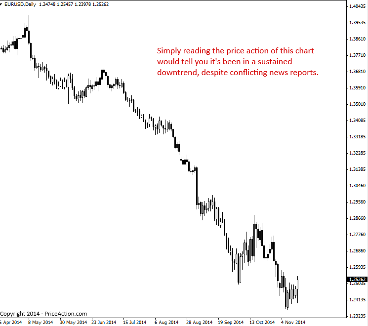

### Why You Should Trade Price Action Instead of News
(뉴스가 아닌 프라이스 액션으로 매매해야 하는 이유)

뉴스부터 경제 지표, 헤지펀드나 은행 같은 대형 플레이어들의 움직임에 이르기까지 시장에 영향을 미치고 시장을 움직이게 만드는 모든 요소는 가격 차트 위의 생생한 프라이스 액션(가격 행동)을 통해 반영됩니다. 따라서 시장의 가격 행동 외부에 존재하는 모든 변수들을 일일이 분석하려는 행동은 불필요할 뿐만 아니라 시간 낭비이며, 전체 매매 과정을 필요 이상으로 훨씬 더 복잡하게 만드는 지름길입니다.

---

#### Fundamental analysis vs. Technical analysis
(기본적 분석 vs. 기술적 분석)

기본적 분석과 기술적 분석 사이의 오래된 논쟁은 아마도 끝이 나지 않을 것입니다. 기본적 트레이더들은 오직 뉴스나 경제 데이터, 즉 '펀더멘털'만을 바탕으로 매매합니다. 이러한 정보를 분석해야 가장 훌륭한 매매 결정을 내릴 수 있다고 믿기 때문입니다. 반면 기술적 분석 트레이더들은 오직 가격 차트만을 보고 매매 결정을 내립니다. 프라이스 액션 트레이더는 기술적 분석 트레이더 중에서도 오직 시장의 가격 움직임, 즉 프라이스 액션만을 기반으로 모든 매매 결정을 내리는 독특한 부류입니다. 다른 기술적 분석가들은 보조지표나 매매 소프트웨어 시스템 등을 사용할지 몰라도, 프라이스 액션 트레이더는 오직 시장의 프라이스 액션만을 활용합니다.

제가 프라이스 액션으로 매매하고 이를 강력히 추천하는 가장 핵심적인 이유는 단순합니다. 어떤 뉴스 이벤트(전쟁, 날씨, 정치 등)부터 경제 지표에 이르기까지 시장에 영향을 미치는 모든 기본적 변수들은 **결국 가공되지 않은 '네이키드(Naked)' 차트 위의 가격 움직임(프라이스 액션)으로 고스란히 반영**되기 때문입니다. 따라서 저를 포함해 성공한 수많은 트레이더들의 관점에서 볼 때, 펀더멘털 데이터를 분석하는 것은 단순히 주의를 분산시키고 시간을 낭비하는 짓에 불과합니다. 어차피 프라이스 액션이 이러한 모든 펀더멘털 데이터를 반영하고 있으므로, 그저 가격 행동을 분석하는 것만으로 시장에 필요한 모든 정보를 얻을 수 있기 때문입니다.

프라이스 액션 트레이딩은 가장 순수한 형태의 시장 데이터를 당신이 사용하기 좋게 필터링하고 정제하여 받아보는 것이라고 생각하십시오. 트레이더로서 우리는 단순히 시장의 가격 움직임을 활용해 수익을 내고자 하는 것이므로, 결국 프라이스 액션으로 이어지게 될 외부 변수들을 분석하려 애쓰기보다 실제 가격 행동 자체를 분석하는 것이 훨씬 합리적입니다. 옛 속담을 빌리자면, 프라이스 액션을 보는 것은 시장 데이터를 '당사자의 입에서 직접(Straight from the horse's mouth)' 듣는 것과 같습니다.

---

#### Noise vs. Clarity
(소음 vs. 명확함)

프라이스 액션은 모든 시장 데이터를 필터링하여 시장에서 실제로 어떤 일이 일어나고 있는지 명확한 그림을 보여줍니다. 만약 매일 시장에 영향을 미칠 수 있는 모든 기본적 변수들을 일일이 분석하려 든다면 스스로 미쳐버릴지도 모릅니다. 이것은 결국 소음(Noise)과 명확함(Clarity)의 싸움입니다. 금융 미디어에서는 X, Y, Z 같은 일이 발생하면 시장이 앞으로 어떻게 움직일지'에 대한 수많은 '소음'을 쏟아냅니다. TV나 인터넷에 나오는 전문가들의 말은 매우 프로페셔널하게 들리지만, 결국 그들이 하는 말은 하나도 중요하지 않습니다. 진짜 중요한 것은 차트가 프라이스 액션을 통해 우리에게 보여주는 사실뿐이기 때문입니다.

아래 차트에서 2014년 5월 초부터 2015년 11월 중순까지 EURUSD(유로달러) 시장이 얼마나 명확한 하락 추세를 보였는지 주목하십시오. 차트의 생생한 프라이스 액션을 읽는 것만으로도 이 기간 동안 하락 추세가 공고히 자리 잡았기 때문에 가격이 계속 떨어질 가능성이 높다는 것을 알 수 있었습니다. 이러한 정보를 바탕으로 우리는 저항선에서의 프라이스 액션 반전 전략을 주시하거나, 하락 추세의 방향과 일치하는 하락 프라이스 액션 돌파 패턴을 노려 매매를 진행할 수 있었습니다. 반면, 이 7달 동안 출시된 수많은 뉴스 기사와 경제 지표 중에는 가격이 상승할 것임을 암시하는 것도 있었고, 반대로 계속 떨어질 것이라 말하는 것도 있었습니다. 가격 차트 위의 가공되지 않은 가격 데이터만 바라봄으로써, 당신은 이러한 모든 소음과 모순된 데이터들을 완벽하게 차단할 수 있습니다.

> 

---

#### Conclusion
(결론)

이 레슨을 읽는 모든 분들이 제 말에 100% 동의하지는 않을 것입니다. 어떤 이들은 금융 미디어에서 매일 쏟아져 나오는 방대한 정보 양에 압도되어, 여전히 펀더멘털 데이터와 경제 뉴스 리포트를 분석해야만 한다고 굳게 믿을 것입니다. 하지만 당신은 결국 무언가 하나를 기준으로 삼아 따르고 매매해야 합니다. 모든 것을 다 따르려고 욕심을 부리면 결국 끊임없는 혼란과 의구심의 늪에 빠지게 될 것입니다.

경험이 많은 트레이더들은 "모든 시장 변수는 필터링되어 네이키드 차트에 반영된다"는 제 말을 더 잘 이해할 것입니다. 하지만 초보자들에게는 처음에 이 사실이 받아들이기 힘든 쓴 약처럼 느껴질 수 있습니다. 그러나 제 시장 경험에 비추어 볼 때, 뉴스나 기타 펀더멘털 데이터에 매달리는 행동은 결국 당신의 투자 계좌를 깡통 차게 만들 것이라 100% 확신합니다. 제 경험상 트레이더는 제한된 양의 데이터만을 분석하고 매매하기 위해 노력해야 하며, 그 데이터(프라이스 액션)를 기반으로 매매 결정을 내려야 합니다. 만약 세상 모든 것에 영향을 받으며 매매 결정을 내린다면, 당신은 진정한 전략이나 매매 우위(Edge)도 없는 그저 도박꾼에 불과할 뿐입니다.

프라이스 액션으로 매매한다고 해서 시장에서 무조건 돈을 벌 수 있다고 보장할 수는 없습니다. 하지만 원칙을 지키고 인내심을 가지며 매매한다면, 이것이 당신에게 최고의 성공 확률을 가져다줄 것임은 보장할 수 있습니다. 프라이스 액션 트레이딩은 당신의 매매에서 많은 심리적 혼란을 제거해 줄 것이며, 자신만의 매매 방법론이 무엇인지, 그리고 시장이 앞으로 어떻게 움직일 수 있는지에 대한 명확함을 선물할 것입니다. 결코 쉽지는 않겠지만, 다음에 CNBC나 블룸버그를 보게 되거나 외환 시장이 앞으로 어떻게 움직일지 예측하는 '전문가'의 기사를 접하게 된다면, 이를 과감히 무시하고 차트로 돌아가 프라이스 액션이 무엇을 말하고 있는지 확인하십시오. 그것이 시장이 실제로 무엇을 **하고 있고**, 앞으로 무엇을 **할 수 있는지**를 파악하는 가장 훌륭한 방법입니다.

[원문: Why You Should Trade Price Action Instead of News](trade-price-action-instead-of-news.en)
