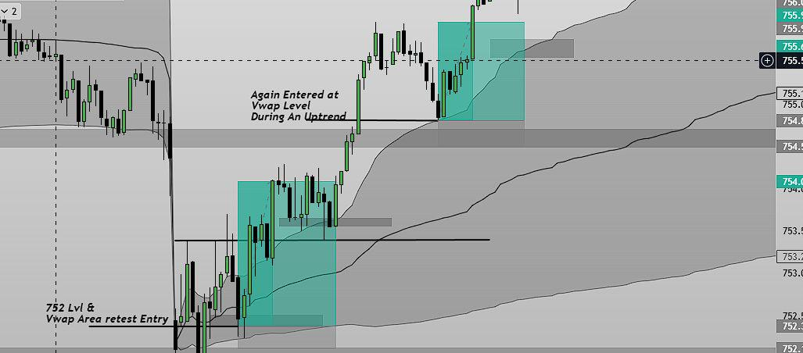

<pre>
<b>VWAP 회복(Reclaim)은 내가 계속 찾게 되는 유일한 인트라데이 셋업이다</b>

그동안 수많은 인트라데이(당일 매매) 셋업을 시도해 봤다.

ORB(시초가 돌파), EMA(지수이동평균) 크로스오버, 모멘텀 추격 매수, 뉴스 매매 등등. 어떤 것은 통했고 어떤 것은 통하지 않았다.
하지만 일관된 구조(Structure) 덕분에 내가 계속해서 다시 돌아오게 되는 단 하나의 셋업은 바로 'VWAP 회복'이다.

<b>이 매매에서 실제로 일어나는 일</b>

VWAP(거래량 가중 평균가격)은 해당 세션 동안 거래된 평균 가격에 거래량 가중치를 둔 지표다.
주가가 VWAP 위에 있을 때는 롱(매수) 셋업에 더 열려 있고, 주가가 VWAP 아래에 있을 때는 롱 진입에 더 주의하거나 추가 하락 연속성을 확인한다.

'회복(Reclaim)'은 주가가 VWAP 아래로 깨고 내려갔다가, 다시 돌아와 그 위에서 종가를 형성할 때 발생한다.
처음에는 매도세가 시장을 장악한 것처럼 보인다. 그들은 주가를 지표 아래로 밀어내기 때문이다.
하지만 매도세가 하락세를 이어가지 못하고 주가가 다시 VWAP을 회복하는 순간, 이 매매는 흥미로워지기 시작한다.

이 방식을 두고 마치 돌파를 예측하는 것처럼 보일 수 있지만, 그렇지 않다.
그저 시장이 '힘의 균형이 이동했다'는 것을 보여줄 때까지 기다렸다가, 유리한 방향에 올라타는 것뿐이다.

<b>내가 노리는 정확한 진입 시점</b>

이 셋업은 주가가 VWAP 아래로 꼬리(Wick)만 다는 것이 아니라, 확실하게 깨고 내려갈 때 시작된다.
매도세가 주가를 지표 밑으로 밀어붙여 잠시 하락세처럼 보이는 깨끗한 이탈(Clean break)을 확인한다.
이후 주가가 다시 올라와 적당한 거래량을 동반하며 VWAP 위에서 캔들 종가를 형성해야 한다.

VWAP 위에서의 종가 마감이 신호(Signal)가 되지만, 나는 보통 거기서 바로 진입하지 않는다.
나는 '리테스트(Retest)'를 기다린다.

내가 진입했던 깔끔한 VWAP 회복 매매들의 상당수는 주가가 회복 후 거의 항상 위에서 아래로 VWAP을 다시 터치하러 내려왔다.
이제는 지지선 역할을 하게 된 VWAP을 다시 확인하는 이 리테스트 시점이 바로 나의 진입점이다.
더 좋은 가격, 더 짧은 손절선, 그리고 더 깔끔한 손익비를 챙길 수 있다.

만약 리테스트에 실패하고 주가가 다시 VWAP 아래로 내려가 마감한다면, 나는 이 매매에 참여하지 않는다.

<b>내 매매 일지에서 가져온 최근 사례</b>

SPY, 오전 중반 세션:
오전 10시 15분경 주가가 VWAP 아래로 떨어졌고, 매도세가 주도권을 잡은 것처럼 보였다.
그들은 주가를 지표 아래로 밀어냈지만 하락 연속성을 만들어내지 못했다.
이것이 내가 처음 포착한 부분이다.
매도세의 힘이 진짜라면 VWAP 아래로 연속적인 하락이 나와야 했다.
하지만 그러지 않고 주가는 다시 지표를 향해 기어 올라오기 시작했다.

오전 10시 28분경,주가는 강한 캔리와 함께 VWAP 위에서 종가를 마감했다.
이것이 '회복'이었다. 하지만 난 여전히 진입하지 않았다.
회복 캔들은 주가가 VWAP 위에 있다는 것만 알려줄 뿐이므로 리테스트를 기다렸다.

오전 10시 34분경, 주가는 VWAP을 터치하러 내려왔고, 지지받은 뒤 반등했다.
거기가 진입점이었다.

손절선(Stop)은 VWAP 바로 아래에 두었다.
VWAP이 지지선으로 버텨주지 못한다면 이 매매 아이디어 자체가 틀린 것이기 때문이다.
리스크는 약 0.15%였다. 목표가는 오전 고점으로 잡았고, 이는 약 2R(리스크 대비 수익 2배) 규모였다.

오전 11시 10분경 주가는 목표가에 도달했다. 군더더기 없이 깔끔한 매매였다.

이 모든 과정은 45분이 걸렸고, 정확히 한 번의 결정만을 필요로 했다.
'리테스트를 기다리고, 지지받을 때 진입하라.'

<b>이 매매를 망치는 요인</b>

지저분한 횡보 장세(Choppy sessions)!

한 시간 동안 주가가 VWAP을 4~5번씩 오르내린다면 나는 그 세션을 통째로 건너뛴다.
이 시점에서는 VWAP이 더 이상 깔끔한 기준선 역할을 하지 못한다.
그저 가격이 위아래로 왔다 갔다 하는 것에 불과하다.

또한 장 마감 전 마지막 1시간 동안에는 이 매매를 피해야 한다.
장이 끝나갈수록 VWAP은 현재 가격 쪽으로 압축되므로 신뢰도가 떨어진다.

내가 선호하는 시간대는 오전 9시 45분부터 오후 12시 30분까지다.
오전 세션이 가장 깔끔한 VWAP 반응을 보여준다.

<b>리스크 관리</b>

나의 손절선은 진입 캔들 아래가 아니라 항상 VWAP 아래에 둔다.
VWAP이 지지선으로 작동하지 않는다면 내 가설이 틀린 것이므로 반드시 빠져나와야 하기 때문이다.

또한 본전(Breakeven)으로 손절선을 너무 일찍 옮기지 않는다.

과거에는 이 실수를 자주 해서, 매매가 제대로 흘러가기도 전에 정상적인 눌림목에서 손절당하곤 했다.
이제는 주가가 내 방향으로 최소 1R 이상 움직였을 때만 손절선 이동을 고려한다.

목표가의 경우, 이전 매물대 구조나 2R 중 먼저 도달하는 쪽으로 단순하게 유지한다.
더 큰 수익을 바라며 미련하게 버티지 않는다.

<b>내가 대부분의 인트라데이 셋업보다 이 셋업을 좋아하는 이유</b>

내가 시도했던 대부분의 셋업은 패턴 기반이었고, 이로 인해 나는 차트 위에서 특정 '모양'만 찾아 헤매게 되었다.

반면 VWAP 회복은 구조(Structure) 기반이며 나에게 명확한 기준을 준다.
실제 시장 참여자들이 주시하고 있는 진짜 레벨에서 매매하는 것이다.
리테스트가 발생하는 이유도 다른 트레이더들 역시 VWAP을 지켜보며 그 자리에서 진입하기 때문이다.
</pre>

[원본: VWAP reclaim is the only intraday setup I keep coming back to](VWAP-reclaim-is-the-only-intraday-setup-I-keep-coming-back-to.en)
