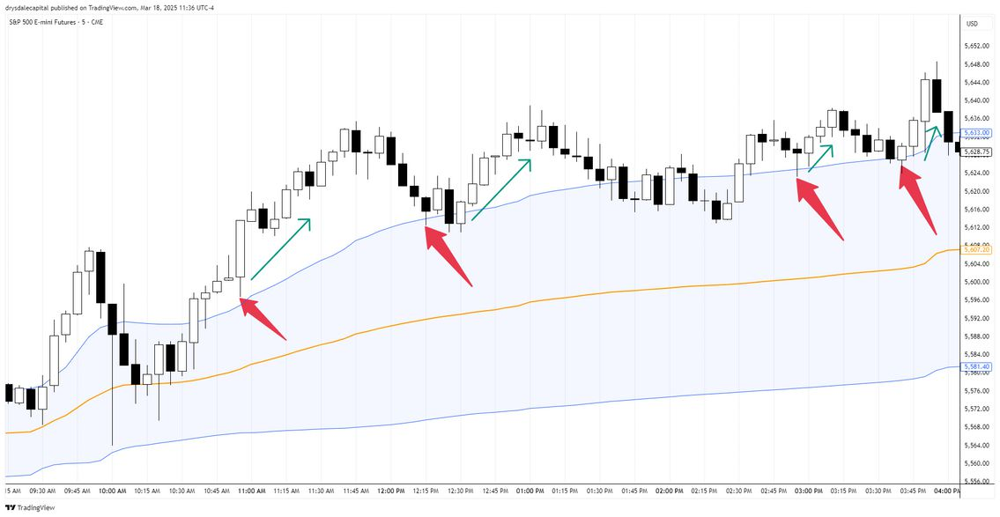
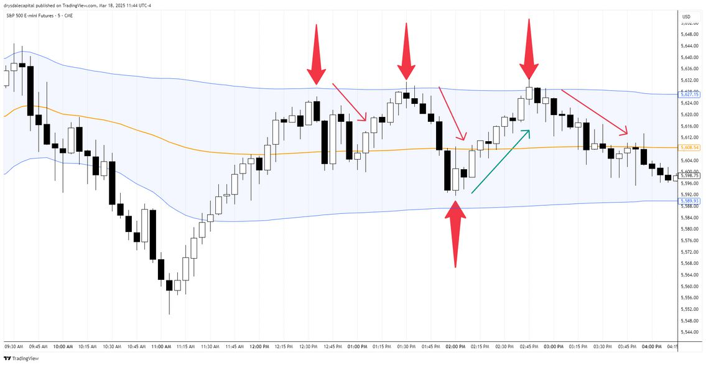
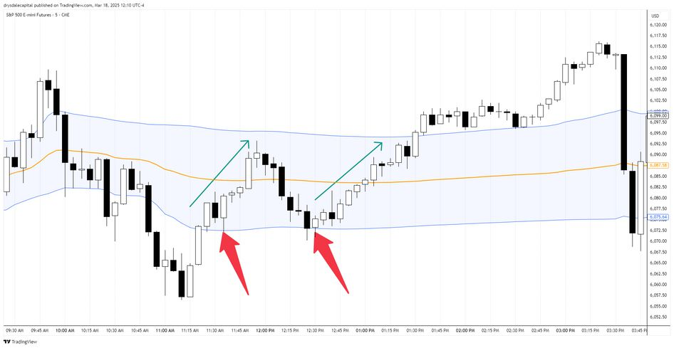
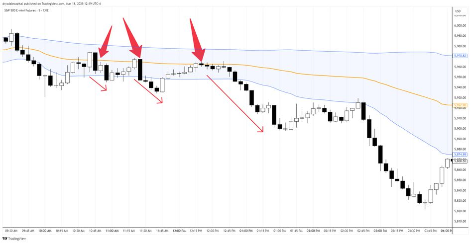

---
---

# VWAP WAVE 핵심 설정 가이드 (Core Setup Guide)
제작: Drysdale Trading Group

---

## VWAP WAVE 기본 원칙 (Principles)

*   트레이딩은 정밀 과학이 아닙니다: 완벽한 정확성이 목표가 되어서는 안 됩니다. 우리의 목표는 완벽함이 아니라 합리적인 근거에 기반한 의사결정입니다.
*   시장은 관성을 가집니다: 시장은 갑자기 방향을 바꾸기보다 현재의 행보를 유지하려는 경향이 있습니다. 변화를 예측하려 하지 말고 지배적인 시장 상황에 순응하십시오. 희망사항이 아닌, 눈에 보이는 것에 기반해 매매하십시오.
*   자석으로서의 VWAP: 가격이 VWAP 가치 영역(Value Area) 내에 유지되거나 재진입할 때, 가격은 종종 VWAP으로 회귀하려는 성질을 보입니다. 만약 VWAP을 뚫고 지나간다면, 다음 목표가는 반대편 가치 밴드(Value Band)가 됩니다.
*   돌파와 수용(Acceptance): 가격이 가치 영역 내로 돌아왔을 때 VWAP은 핵심적인 자석 역할을 합니다. 만약 VWAP을 돌파하여 안착(Accept)하지 못한다면, 가장 최근의 극단적인 가치 밴드로 이동할 것을 예상하십시오.
*   가치 영역 내의 혼조세: VWAP 가치 영역 내에서의 매매는 종종 변동성이 크고 지저분합니다. 속임수 동작(False move)으로 인한 불필요한 손실을 피하도록 접근 방식을 조절하십시오.
*   가치 영역 돌파: 가격이 가치 영역을 벗어나면 대개 돌파 방향으로 새로운 레벨을 탐색하려 하며, 종종 이전의 가치 구역을 목표로 삼습니다.
*   셋업의 질: 모든 매매가 동일한 가치를 갖는 것은 아닙니다. 가장 고품질의 셋업은 새로운 맥락의 전환점(Contextual shifts) 근처에서 나타나며, 이곳에 최고의 기회가 있습니다.
*   불확실성 수용: 이 전략은 시장 행동을 해석하는 구조화된 방법을 제공하지만, 모든 시나리오를 완벽하게 이해할 수는 없습니다. 필요한 경우 불확실성을 받아들이십시오.

---

## 핵심 매매 셋업 (Trading Setups)

### 셋업 1: 가격 발견 지속 (Price Discovery Continuation)
> 개념: 가치 영역을 돌파한 추세가 지속될 때 눌림목을 공략하는 전략

*   진입 조건:
    1. 가격이 VWAP 가치 영역을 돌파함.
    2. 가격이 가치 영역 밖에서 일정 시간이나 거리를 유지하며 '수용(Acceptance)'되는 모습을 보여야 함.
*   진입 타점: VWAP 편차 밴드(Deviation Band)를 다시 테스트하는 되돌림(Backtest Pullback) 시 진입.
*   확인: 되돌림 테스트 후 다시 추세 방향으로 힘이 실리는 첫 신호에 진입.
*   손절매: 되돌림 캔들의 고점/저점 위아래로 몇 틱 여유를 두고 설정.
*   참고: 돌파 즉시 진입할 수도 있으나, 안착을 기다리지 않으면 거부(Rejection) 신호에 당할 수 있음을 유의하십시오.

> 

---

### 셋업 2: 가치 영역 극단 페이딩 (Fade Value Area Extremes)
> 개념: 박스권 장세에서 가치 영역 상/하단 밴드의 반전을 노리는 역추세 전략

*   진입 조건:
    1. 가격이 가치 영역 내부에서 시간을 보내고 있음.
    2. 가치 영역 내부에서 일정 시간/거리를 유지하며 '수용'된 상태여야 함.
*   진입 타점: VWAP 편차 밴드 영역을 테스트할 때 나타나는 첫 번째 약세 또는 거부(Rejection) 신호에 진입.
*   방법: 밴드 터치 시 진입하거나, 해당 근처에서 분할 진입 가능.
*   손절매: 테스트 캔들의 꼬리(Wick) 위아래 몇 틱 지점에 설정.
*   참고: 이 셋업은 짧은 손절이 가능합니다. 밴드를 강하게 돌파하거나 타고 올라가는(Grind through) 모습이 보이면 즉시 탈출 신호로 간주하십시오.

> 

---

### 셋업 3: 가치 영역으로의 귀환 (Return to Value)
> 개념: 외부에서 머물던 가격이 다시 가치 영역 내부로 진입할 때를 공략

*   진입 조건: 가격이 외부 구역에서 일정 시간/거리를 보낸 후, 다시 가치 영역 내부로 돌파 진입함.
*   진입 타점: 가치 영역 내부로 들어온 뒤 안착을 보여주고, 다시 밴드를 테스트하는 되돌림(Backtest Pullback) 시 진입.
*   방법: 돌파 직후 진입도 가능하나 리스크 관리가 필요함.
*   손절매: 테스트 캔들의 꼬리 위아래 몇 틱 지점.
*   참고: 종종 되돌림 없이 바로 가는 경우가 많으므로, 이럴 경우 유일한 진입 타점은 가치 영역 내부 돌파 시점이 됩니다.

> 

---

### 셋업 4: VWAP 반등 (VWAP Bounce)
> 개념: 가치 영역 중심인 VWAP 라인에서의 지지/저항을 이용한 매매

*   진입 조건: 변동성이 큰 날(High Volatility Days)에 적합하며, 가격이 가치 영역 안팎을 넘나들어야 함.
*   진입 타점: 가격이 가치 영역으로 들어온 뒤 VWAP 라인을 테스트할 때.
*   확인: VWAP 테스트 후, VWAP에서 멀어지는 방향으로 힘이 실릴 때 진입.
*   손절매: 테스트 캔들의 꼬리 위아래 몇 틱 지점.
*   참고: VWAP은 대형 기관들이 물량을 주고받는 지저분한 구역일 수 있습니다. 'VWAP 돌파 후 즉시 회복(Break and Reclaim)'과 같은 속임수와 심리 게임이 자주 발생함을 예상하십시오.

> 

---
*본 가이드는 Drysdale Trading Group의 전략을 바탕으로 번역되었으며, 실제 매매 시에는 충분한 백테스트와 리스크 관리가 동반되어야 합니다.*
