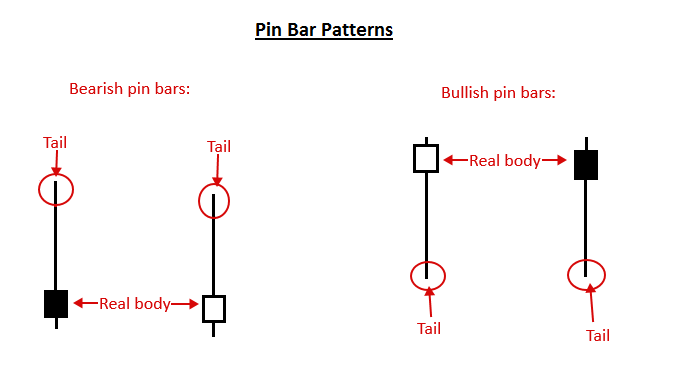
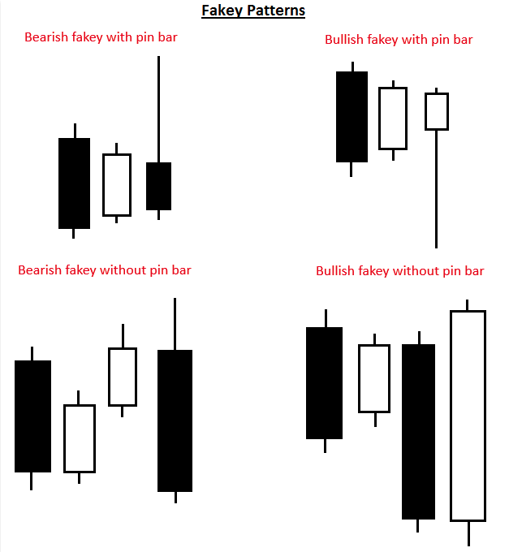
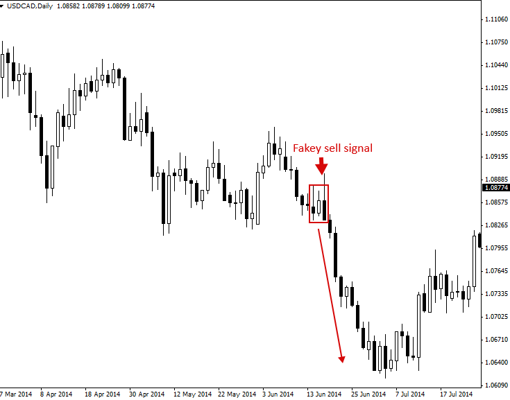
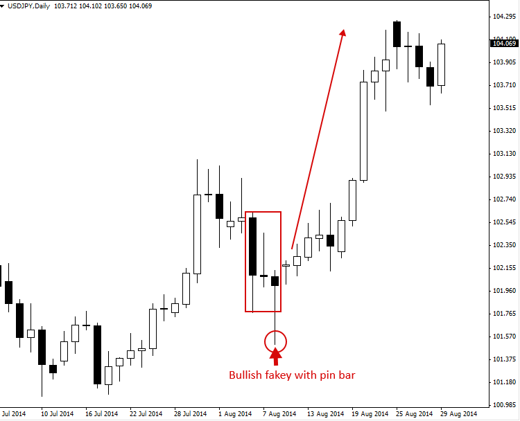
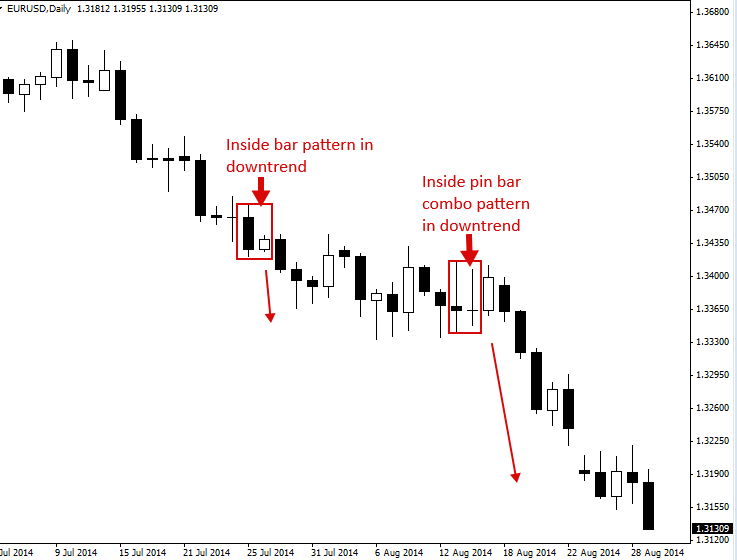
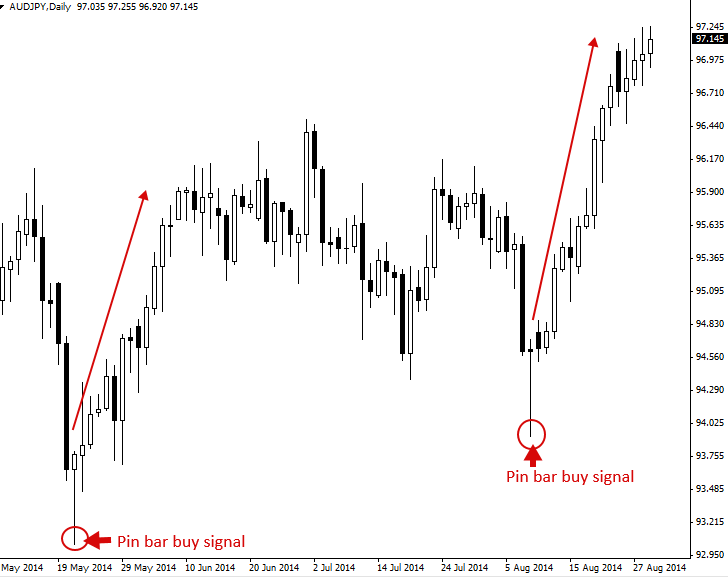
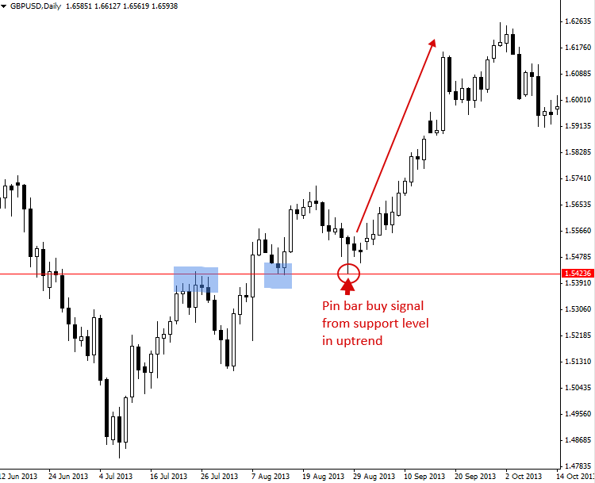

### What Is Price Action? – Price Action Trading Introduction

#### What is Price Action? – Price Action Trading Explained

Price action trading은 시간 경과에 따른 기본적인 가격 변동을 분석하여 금융 시장을 예측하는 매매 방법론입니다. 많은 개인 Trader(retail traders)뿐만 아니라 기관 투자자(institutional traders)와 Hedge fund manager들이 특정 자산이나 금융 시장의 향후 가격 방향을 예측하기 위해 이 방식을 자주 사용합니다.

간단히 말해, Price action은 가격이 어떻게 변하는지, 즉 가격의 '움직임(action)'을 뜻합니다. Liquidity(유동성)와 Volatility(변동성)가 높은 시장에서 가장 쉽게 관찰되지만, 사실 자유 시장에서 사고파는 모든 자산은 Price action을 만들어냅니다.

Price action trading은 시장의 움직임에 영향을 미치는 Fundamental(펀더멘털) 요소를 배제합니다. 그 대신 시장의 Price history, 즉 일정 기간 동안의 가격 변동을 주로 살펴봅니다. 따라서 Price action은 Technical analysis(기술적 분석)의 한 형태입니다. 하지만 일반적인 Technical analysis와 다른 점은, 가격 역사에서 파생된 '이차적(second-hand)' 지표에 의존하기보다 현재 시장 가격과 과거 또는 최근 가격 간의 상호 관계에 주된 초점을 맞춘다는 것입니다.

다시 말해, Price action trading은 가격에서 파생된 이차적 Indicator(지표)를 포함하지 않기 때문에 가장 '순수한(pure)' 형태의 Technical analysis입니다. Price action trader들은 시장이 스스로 만들어내는 일차 데이터(first-hand data), 즉 시간 경과에 따른 가격 움직임에만 온전히 집중합니다.

- Price action 분석을 통해 Trader는 시장의 가격 변동을 이해할 수 있으며, 현재의 Market structure(시장 구조)를 설명하는 시나리오를 구상할 수 있는 근거를 얻게 됩니다. 숙련된 Price action trader들은 시장에 대한 자신만의 고유한 직관적 이해와 '촉(gut feel)'을 수익성 높은 매매의 핵심 이유로 꼽곤 합니다.

Price action trader들은 시장의 과거 Price history를 활용하며, 대개 최근 3~6개월 동안의 Price action에 집중하고 그보다 더 오래된 가격 역사는 가볍게 참고합니다. 이러한 Price history에는 시장의 Swing high(고점)와 Swing low(저점)뿐만 아니라, Support(지지) 및 Resistance(저항) level이 포함됩니다.

Trader는 시장의 Price action을 활용해 시장 움직임의 이면에 숨겨진 인간의 심리적 사고 과정을 분석할 수 있습니다. 시장의 모든 참여자는 매매를 진행하면서 가격 차트에 Price action이라는 '단서(clues)'를 남기며, Trader들은 이 단서를 해석하여 시장의 다음 움직임을 예측하는 데 활용합니다.

#### Price Action Trading – Keeping it Simple

Price action trader들은 흔히 "KISS(Keep It Simple Stupid, 단순하게 만들어라)"라는 문구를 자주 사용합니다. 이는 많은 사람이 수많은 Technical indicator로 차트를 복잡하게 만들고, 시장을 전반적으로 과도하게 분석함으로써 매매를 스스로 어렵게 만든다는 사실을 지적하는 표현입니다.

- Price action trading은 단순한 가격 움직임만을 담은 차트를 기반으로 매매한다는 점에서, 때로 'Clean chart trading', 'Naked trading', 'Raw or natural trading'이라고 불리기도 합니다.

이처럼 불필요한 요소를 모두 걷어낸 Price action trading의 단순한 접근 방식은 Trader의 차트에 그 어떤 Indicator도 띄우지 않으며, 매매 의사결정을 내릴 때 경제 이벤트나 뉴스도 활용하지 않음을 의미합니다. 오직 시장의 Price action에만 온전히 집중하며, Price action trader들 사이에서는 이 가격 움직임이 시장에 영향을 주고 움직이게 만드는 모든 변수(뉴스 이벤트, 경제 데이터 등)를 이미 반영하고 있다는 믿음이 존재합니다. 따라서 매일 시장에 영향을 미치는 수많은 변수를 일일이 해독하고 분류하려고 애쓰는 것보다, 단순히 시장을 분석하고 그 Price action을 바탕으로 매매하는 것이 훨씬 더 단순하고 효율적이라는 의미를 내포하고 있습니다.

#### Price Action Trading Strategies (Patterns)

Price action pattern은 Price action ‘trigger’, ‘setup’ 또는 ‘signal’이라고도 불리며, Price action trading에서 가장 중요한 요소입니다. 왜냐하면 이 pattern들이 향후 가격이 어떻게 움직일지에 대한 강력한 clue(단서)를 Trader에게 제공하기 때문입니다.

다음 다이어그램들은 시장 매매에 활용할 수 있는 몇 가지 간단한 Price action trading strategy의 예시를 보여줍니다.

- Inside bar pattern

Inside bar pattern은 두 개의 bar로 구성된 pattern으로, Inside bar와 그 이전의 bar인 “Mother bar”로 이루어집니다. Inside bar는 Mother bar의 고점(high)과 저점(low) 범위 내에 완전히 포함됩니다. 이 Price action strategy는 주로 Trending market(추세 시장)에서 Breakout(돌파) pattern으로 사용되지만, 주요 차트 레벨(key chart level)에서 형성될 경우 Reversal(반전) signal로 매매할 수도 있습니다.

> 

- Pin bar pattern

Pin bar pattern은 단 하나의 Candlestick(캔들스틱)으로 구성되며, 가격의 Rejection(거부)과 시장의 Reversal(반전)을 나타냅니다. Pin bar signal은 Trending market이나 Range bound market(박스권 시장)에서 매우 효과적이며, 주요 Support(지지) 또는 Resistance(저항) level에서 Counter-trend(역추세) 매매로 활용할 수도 있습니다. Pin bar는 꼬리(tail)가 가리키는 방향과 반대로 가격이 움직일 수 있음을 암시합니다. Pin bar의 꼬리가 바로 가격의 거부와 반전을 나타내기 때문입니다.

> 

- Fakey pattern

Fakey pattern은 Inside bar pattern의 False breakout(속임수 돌파)으로 구성됩니다. 다시 말해, Inside bar pattern이 일시적으로 돌파(breakout)하는 듯하다가 이내 반전하여 Mother bar나 Inside bar의 범위 안으로 돌아와 마감되면 Fakey가 성립됩니다. 트레이더를 속인다(fake out)는 의미에서 “Fakey”라고 불리며, 시장이 한쪽 방향으로 돌파하는 것처럼 보이다가 반대 방향으로 되돌아와 그 반대 방향으로의 가격 변동을 유발합니다. Fakey는 추세 추종, 주요 레벨에서의 역추세 매매, 그리고 Trading range(박스권) 매매 모두에 훌륭한 패턴입니다.

> 

#### Trading with Price Action Patterns

실제 차트 예시를 통해 Price action pattern을 활용한 매매 방법을 살펴보겠습니다.

첫 번째 차트는 Bearish fakey sell signal pattern을 보여줍니다. 이 예시에서 추세는 이미 하락세였습니다. 차트 왼쪽 상단에서 시작해 오른쪽으로 이동할 수록 가격이 떨어지는 전체적인 하향 궤적을 확인할 수 있습니다. 따라서 이 Fakey sell signal은 일봉 차트(daily chart)의 전체적인 하락 추세(downtrend)와 일치하며, 이는 긍정적인 신호입니다. 일반적으로 추세에 맞추어 매매(trading with the trend)하면 Price action setup이 유리하게 작용할 확률이 높아집니다.

> 

아래 차트는 상승하는 시장 상황에서 발생한 Bullish fakey pin bar combo setup의 예시를 보여줍니다. 통상적으로 시장이 강력한 단기적 편향(near-term bias)을 보일 때, 즉 최근 특정 방향으로 공격적으로 움직이고 있을 때, Price action trader는 그 단기 Momentum(모멘텀)과 일치하는 방향으로 매매하고자 합니다.

> 

다음 예시에서는 Inside bar trading pattern을 살펴보겠습니다. 이 차트는 일반적인 Inside bar signal과 Inside pin bar combo setup을 모두 보여줍니다. Inside pin bar combo는 단순히 Inside bar 자리에 Pin bar가 위치한 형태를 말합니다. 이러한 setup은 아래 차트에서 보는 것처럼 Trending market에서 매우 강력한 효과를 발휘합니다.

> 

마지막 차트는 Pin bar pattern의 예시를 보여줍니다. 이 두 Pin bar buy signal 이후에 나타난 거대한 상승 움직임에 주목하십시오. 또한, 이 Pin bar들이 차트 상에서 Pin bar로 보일 만한 다른 bar들에 비해 얼마나 긴 꼬리(tail)를 가지고 있는지 확인해 보시기 바랍니다. 이 두 예시처럼 보기 좋은 긴 꼬리를 가지고 주변의 Price action 밖으로 명확하게 돌출된(protruding) Pin bar는 매매하기에 매우 훌륭한 setup인 경우가 많습니다.

> 

#### Trading Price Action Patterns with Confluence

Price action signal을 활용한 매매는 단순히 signal 자체만을 보는 것이 아니라, 그 signal이 차트의 '어느 위치'에서 형성되었는지가 매우 중요합니다. 모든 Pin bar나 Inside bar 등이 동일한 가치를 가지는 것은 아닙니다. 특정 Price action signal이 시장의 어디에서 형성되느냐에 따라 매매를 보류해야 할 수도 있고, 주저 없이 진입해야 할 수도 있습니다.

가장 우수한 Price action signal은 시장의 'Confluent(합류/중첩)' 포인트에서 형성되는 신호들입니다. Confluence란 쉽게 말해 사람이나 사물이 '한데 모이는 것'을 의미합니다. Price action trading의 관점에서는 차트 상에서 최소한 몇 가지 요소가 Price action 진입(entry) signal과 일치하는 영역을 찾는 것을 뜻합니다. 이러한 현상이 발생할 때, 우리는 해당 Price action signal이 'Confluence를 가졌다'고 말합니다.

아래 차트 예시에서 Confluence를 가진 Pin bar pattern의 좋은 사례를 확인할 수 있습니다. 여기서 Confluence란, 이 Pin bar가 상승 추세(up-trending) 시장의 방향과 일치하게 형성되었으며 동시에 그 상승 추세 내의 Support(지지) level에서 형성되었다는 점입니다. 즉, Trend(추세)와 Support level이라는 두 가지 요소의 Confluence가 존재하며, 이 요소들이 결합하여 signal을 뒷받침함으로써 이 Pin bar buy signal에 훨씬 더 많은 무게감을 실어줍니다. Price action signal을 뒷받침하는 Confluent 요사들이 많을수록, 이는 더욱 높은 확률(higher-probability)을 가진 signal로 간주됩니다.

> 

#### Conclusion

- 이번 Price action trading 튜토리얼이 도움이 되셨기를 바랍니다. 이제 여러분은 Price action이 무엇인지, 그리고 이를 활용해 어떻게 매매하는지에 대한 탄탄한 기초 지식을 갖추게 되었습니다.

- 여기서 다룬 내용보다 훨씬 더 많은 지식이 존재하므로, 앞으로 Price action trading에 대한 이해와 지식을 더욱 넓혀 나가시기를 바랍니다.
